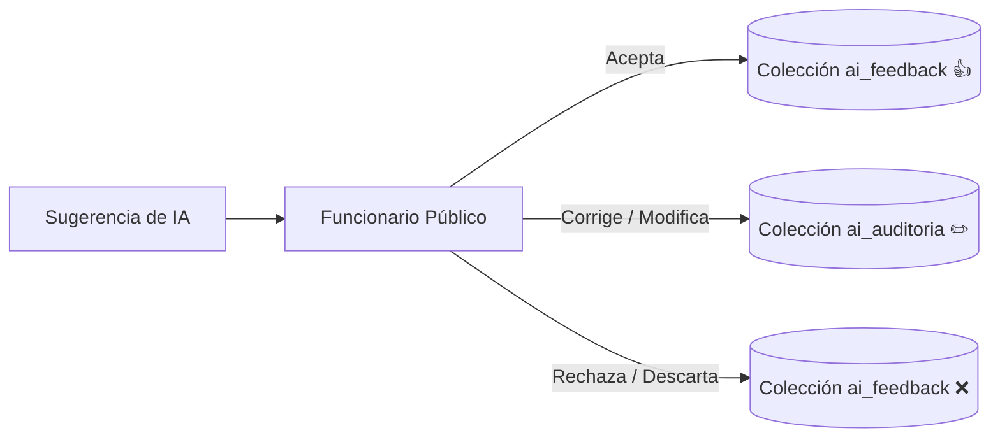

# Marco de Gobernanza de Inteligencia Artificial
## Ventanilla Única Inteligente · Simacota

Este documento formaliza la gobernanza ética, legal y técnica de los modelos de Inteligencia Artificial que operan dentro de la Ventanilla Única del Municipio de Simacota. Garantiza el cumplimiento de las normativas de transparencia colombianas y el control administrativo absoluto sobre los sistemas algorítmicos.

---

## 1. Fundamentos Legales y de Transparencia

El uso de sistemas automáticos de procesamiento y asistencia de lenguaje en Simacota se alinea estrictamente con los siguientes marcos legales colombianos:

* **Ley 1712 de 2014 (Ley de Transparencia y del Derecho de Acceso a la Información Pública Nacional)**: La IA no puede operar como una "caja negra". Todos los criterios de enrutamiento semántico, categorización de riesgos e inferencia de copilotos deben ser auditables y explicables.
* **Ley Estatuaria 1581 de 2012 (Protección de Datos Personales - Habeas Data)**: Los inputs de clasificación y las transcripciones de chat con el asistente SIMI se limpian de datos sensibles en el cliente o se restringen mediante políticas de acceso rigurosas. La información confidencial del ciudadano no se utiliza para entrenar o ajustar modelos comerciales externos.

---

## 2. El Postulado de Oro de Simacota

> [!IMPORTANT]
> **"Los agentes de IA recomiendan; los funcionarios humanos deciden."**
> 
> Ninguna acción administrativa sustancial (traslado de dependencias, definición de plazos legales de respuesta, aprobación de prórrogas o redacción de la respuesta final al ciudadano) se realiza de forma autónoma por un modelo algorítmico. La IA opera única y exclusivamente como una herramienta de apoyo cognitivo para potenciar la eficiencia del servidor público.

---

## 3. Arquitectura de Auditoría e Intervención Humana (Overrides)

Para medir la precisión de la IA y detectar sesgos cognitivos o desvíos semánticos, el sistema implementa una capa de auditoría activa de tres pilares:

### 3.1. Colección `ai_feedback`
Registra el feedback binario directo (`positivo`, `negativo`) proporcionado voluntariamente por el funcionario mediante los botones de votación en el Panel de Gestión. Almacena la confianza promedio del modelo al momento de la sugerencia para identificar umbrales de degradación del servicio.

### 3.2. Colección `ai_auditoria` (Trazabilidad de Overrides)
Se genera de forma completamente automatizada en el backend cuando ocurre una discrepancia operativa:
* **Ejemplo**: La IA clasifica y sugiere que un radicado debe dirigirse a *Planeación e Infraestructura* con prioridad *Naranja*. El funcionario recibe el trámite y, tras su análisis, ejecuta un traslado hacia la *Secretaría de Gobierno* o cambia la prioridad a *Rojo*.
* **Captura**: El sistema intercepta el evento de traslado y registra en `ai_auditoria` el estado original sugerido por la IA frente al estado final definido por el humano, incluyendo los motivos explicados por el funcionario.
* **Toma de Decisiones**: Estos datos constituyen el dataset municipal de aprendizaje continuo para refinar prompts y afinar umbrales determinísticos en fases posteriores.

---

## 4. Algoritmo de Detección de Deriva (Confidence Drift)

El sistema incorpora un algoritmo de detección de deriva semántica en el panel de supervisión de administración. Este algoritmo evalúa dinámicamente:
1. **Desviación de Oficina Destino (Dependency Drift)**: Porcentaje de radicados en los cuales el destino final asignado por humanos difiere de la sugerencia original de la IA. Si supera el `25%` en una ventana de 30 días, alerta sobre un posible desajuste en los prompts del clasificador.
2. **Degradación de Confianza Promedio (Score Drift)**: Monitoreo de la confianza estadística reportada por Gemini API. Una caída sostenida por debajo del `0.70` (escala 0-1) gatilla un estado de salud visual **Amarillo (Fallback / Degradado)** en el panel administrativo.
