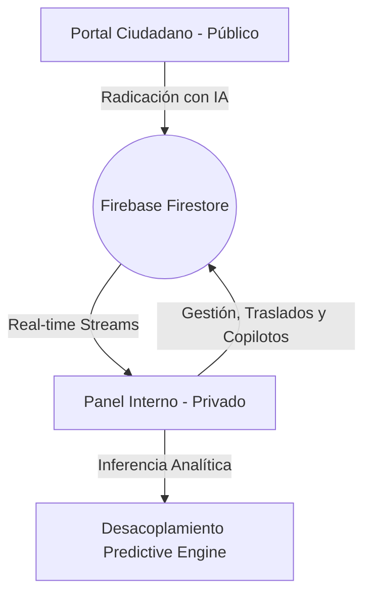
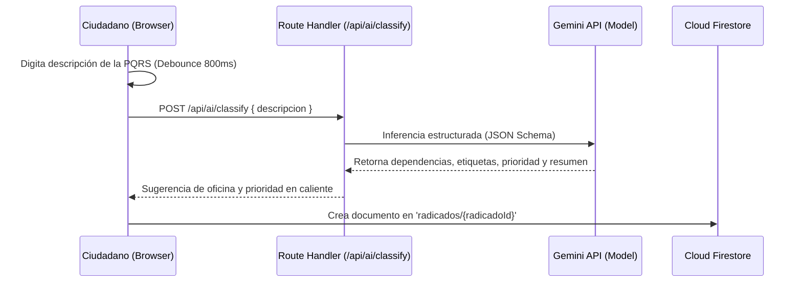

# Arquitectura General y Flujo de Datos
## Ventanilla Única Inteligente · Simacota

Este documento detalla la arquitectura de software de la **Ventanilla Única Inteligente del Municipio de Simacota**, una plataforma institucional robusta construida con Next.js, TypeScript y Firebase. El sistema integra flujos transaccionales gubernamentales en tiempo real con una capa predictiva y de inteligencia artificial asistiva.

---

## 1. Visión Holística del Ecosistema

El sistema se divide en dos grandes interfaces conectadas al mismo núcleo transaccional en la nube:

1. **Portal Ciudadano (Público)**: Interfaz accesible para la ciudadanía. Permite la radicación guiada de PQRSD (Peticiones, Quejas, Reclamos, Sugerencias y Denuncias) con asistencia conversacional y semántica en tiempo real (Asistente SIMI).
2. **Panel Administrativo (Privado)**: Consola interna para funcionarios públicos y administradores. Implementa flujos de asignación, traslados, respuestas, prórrogas, supervisión de IA y el panel de anticipación de riesgos operativos.

---

## 2. Flujo de Radicación y Clasificación Semántica

Cuando un ciudadano interactúa con el formulario de radicación, el sistema ejecuta un pre-análisis cognitivo asíncrono para optimizar el enrutamiento:

* **Debounce de Entrada**: Para evitar sobre-saturar la API de Gemini, se implementa un debounce de `800ms` en el input del texto descriptivo antes de disparar la llamada al clasificador.
* **Fallback Silencioso**: Si la API de Gemini excede el tiempo límite o falla, se activa un motor de regex determinístico local por palabras clave para inferir dependencias críticas (ej. "agua", "acueducto" -> *Planeación e Infraestructura*), garantizando resiliencia del 100%.

---

## 3. Reactividad en Tiempo Real (Real-time Streams)

El Panel Administrativo no realiza peticiones periódicas (polling) para listar o actualizar trámites. Se suscribe directamente a los cambios en Firestore utilizando el patrón Observer provisto por el SDK de Firebase (`onSnapshot`):

* **Reactividad en `todosLosRadicados`**: El store centralizado (`lib/store/ventanillaStore.tsx`) inicializa una conexión persistente. Cualquier cambio en un radicado (cambio de estado, asignación de responsable, radicación nueva) se propaga instantáneamente a todas las pantallas activas en menos de `200ms`.
* **Beneficio**: Elimina la carga de red innecesaria en el servidor, reduce los costos operativos de base de datos mediante lecturas eficientes en caché y garantiza consistencia operativa inmediata entre despachos.

---

## 4. Desacoplamiento del Motor Analítico (Predictive Engine)

Las capacidades analíticas e predictivas de la plataforma (Fase 4.1) están completamente desacopladas de la persistencia de datos tradicional. 

El directorio `lib/ai/predictive/` opera como un **Cerebro Analítico Determinístico**:
* Consume los datos de radicados estructurados y calcula dinámicamente el riesgo de vencimiento ($P_{venc}$), la saturación de secretarías ($I_{sat}$), y la deriva de tendencias ($\Delta_{sem}$) sin alterar el modelo de base de datos relacional/NoSQL subyacente.
* **Explicabilidad**: El módulo de `explainability.ts` traduce las salidas matemáticas y los coeficientes ponderados a justificaciones lingüísticas claras para el tomador de decisiones gubernamentales (ej. *"Prioridad de riesgo alta debido a que la secretaría de Planeación tiene el 85% de su capacidad superada"*).
* **Copilotos Especializados**: Al abrir la pestaña "Copiloto IA ✦", se compone un `ContextoIARadicado` unificado a través de `lib/ai/context-engine/index.ts`, permitiendo alimentar a los agentes especializados de cada secretaría con un historial limpio, coherente y enriquecido.
