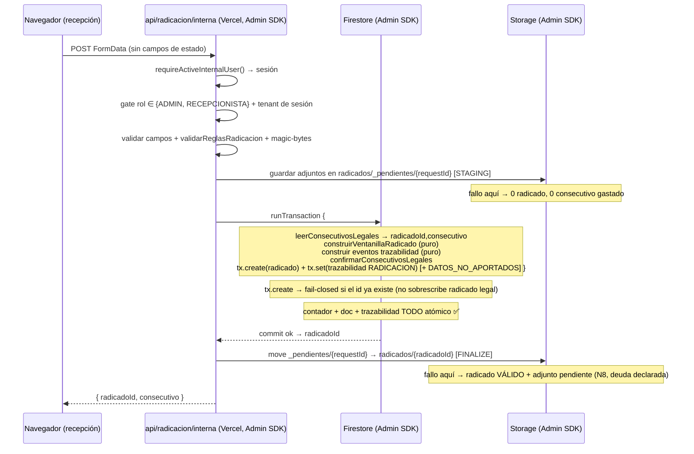

# Blueprint Arquitectónico — Pieza Angular · Radicación interna a servidor (P2.1)

**Estado:** REVISADO POR PARES — LISTO PARA DECISIÓN DEL PROPIETARIO —
*no autoriza implementación* (ADR-0023). Rige la gobernanza vigente (ADR-0001,
0014–0024). Este documento es diseño; **cero código de producción**. La revisión
cruzada de 3 especialistas (seguridad, firestore-datos, qa) está incorporada
(ver §Cambios de la v2); resta el visto bueno del propietario.

- **Capacidad / dominio:** D1 (Recepción / Radicación institucional) — ruta
  INTERNA de radicación (`lib/actions/radicarVentanilla.ts`).
- **Iniciativas / decisiones origen:** `docs/PLAN_BLOQUE3.md` D1+D2 (pieza
  angular) → cierre en cascada D3/D4/D5. Auditoría integral 2026-07-20
  (CR-1, CR-2).
- **ADRs relacionados:** 0016 (consecutivo legal atómico · patrón H3), 0023
  (blueprint arquitectónico · análisis crítico), 0024 (formato radicado legado
  `1-110-AAAAMM`), 0013 (compuerta de despliegue), 0008 (aislamiento por tenant).
- **Versión / revisión:** v2 — 2026-07-20 — condiciones de la revisión cruzada
  (seguridad / firestore-datos / qa) incorporadas sobre el v1 (commit ee9cf99),
  sin implementación.

> **Alcance del blueprint:** diseñar la migración de la radicación INTERNA de
> cliente a servidor, la consolidación del constructor del radicado y el cierre
> seguro de reglas. NO incluye D6 (N8 lifecycle de Storage), D7 (wrapper), ni
> D8 (N5 tests frágiles) — se referencian como frontera.

---

## Cambios de la v2 (revisión cruzada)

Tres especialistas revisaron el v1 (commit `ee9cf99`). Este v2 incorpora sus 14
condiciones. Resumen por revisor (detalle en las secciones marcadas):

**Seguridad (4):**
- **[ALTA] Cierre de `storage.rules`.** El alcance del cierre de reglas (M3 /
  paso 7) incluye ahora cerrar `storage.rules` `match /radicados/{radicadoId}/{archivo}`
  `create → if false`. El `allow create` cliente actual es una superficie de
  escritura **paralela** a CR-1 (cualquier interno autenticado escribe archivos a
  `radicados/{cualquierId}`). Ver §Reglas a cerrar, §Migración paso 7, §Seguridad, R9.
- **[MEDIA] `tx.create` para el doc del radicado** (no `tx.set`): fail-closed
  ante id colisionante en vez de sobrescribir en silencio un radicado legal. Ver
  §Flujo NUEVO, §Nota de diseño, §Seguridad.
- **[MEDIA] Fuente de evidencia de "0 escrituras cliente"** definida en el runbook
  del paso 6 (audit-log de Firestore o instrumentación), **no** el test de reglas.
  Ver §Migración paso 6.
- **[BAJA] `tipoPresentacion` es entrada legítima** (recepción elige
  ANONIMA / RESERVADA): se acepta con whitelist enum y de ella se derivan
  server-side `esAnonimo` / `identidadReservada` / placeholder. Se distingue de
  los campos de estado prohibidos. `MAX_FILES` / `MAX_FILE_SIZE` + magic-bytes
  sobre buffer real, replicados server-side. Ver §Autorización.

**Firestore-datos (4 + 1):**
- **[BLOQUEANTE] Tests golden/paridad de la forma en disco** del
  `VentanillaRadicado` de **cada** superficie antes/después del refactor (mitiga
  shared-fate R4). El constructor es un **superset parametrizado** — nunca aplana
  campos; el manejo de N adjuntos se toma de `api/radicacion` (no de salidas, que
  es 1 archivo). Ver §M1, §Pruebas, R4.
- **[BLOQUEANTE] Divergencia de sanitización resuelta.** La interna usa
  `sanitizeFirestoreData` (undefined→null, **conserva** clave) vs.
  `removeUndefinedDeep` (**elimina** clave) — afecta `solicitante.datosNoAportados`.
  Se decide null-vs-ausente explícitamente y se lóckea en el test de paridad;
  se auditan los lectores del campo. Ver §M1, §Pruebas.
- **[BLOQUEANTE] Secuencia dura de reglas:** cerrar counters/create es deploy
  **separado posterior** al cutover confirmado; `--dry-run` en el paso 7; test
  e2e/rules que falle en rojo con reglas cerradas (estado deseado post-cutover).
  Ver §Secuencia DURA, §Migración paso 7, §Pruebas.
- **Confirmar tras cutover** que el peek cliente es el **único** lector de
  `counters`; si lo es, evaluar cerrar también `read` (defensa en profundidad,
  **no bloqueante**). Ver §Seguridad, DoR.
- **DECISIÓN RESUELTA (trazabilidad en tx):** id determinístico **dentro** de la
  tx. Doc del radicado = `tx.create`; eventos de trazabilidad = `tx.set` con id
  determinístico — ambos dentro de la tx. Idempotente ante reintento, superior a
  `.add()` post-commit. Casilla de la DoR marcada RESUELTA.

**QA (5):**
- **Fila dedicada:** tx aborta ⇒ **ni** radicado **ni** evento de trazabilidad
  parcial (el invariante NUEVO que esta pieza reclama cerrar).
- **Compromiso explícito:** el test de concurrencia+fallo invoca el **endpoint
  real** (`api/radicacion/interna`) contra el emulador, **no** una reimplementación
  inline (el harness `e2e/rules/h3-atomicidad-integracion.test.mjs` es el
  antipatrón a NO copiar).
- **Fila para fallo en `staging`** (antes de la tx) ⇒ 0 consecutivo gastado,
  0 radicado.
- **Fila "Reglas pre-cutover" redefinida:** es un guardarraíl **estático**
  (reglas-tal-como-están-en-repo); R1 se mitiga por **runbook**, no por ese test.
- Matriz de autorización y de forja: correctas, se mantienen sin cambio.

---

## Resumen ejecutivo y objetivo

**Problema (auditoría 2026-07-20).** La radicación INTERNA — la que usa la
funcionaria de recepción, ruta operativa más crítica del sistema — se ejecuta
**client-side** en `lib/actions/radicarVentanilla.ts`. Tres defectos
estructurales encadenados:

- **CR-2 (integridad).** No reutiliza el helper canónico transaccional
  `lib/server/consecutivo-legal.ts`; escribe la trazabilidad **fuera** de la
  transacción (`radicarVentanilla.ts:358-398` — radicado sin evento
  `RADICACION` si el `addDoc` posterior falla) y sube adjuntos **antes** de la
  transacción con una ruta derivada de un *peek* del contador
  (`:204-211` — adjuntos huérfanos si el número cambia o la tx aborta).
- **CR-1 (autorización).** Como la escritura nace en el navegador, las reglas
  `firestore.rules` mantienen `counters` (`:208-211`) y el `create` de
  `ventanilla_radicados` (`:143-144`) **escribibles desde cliente**: un token
  de recepcionista o admin puede **resetear el consecutivo legal** o **forjar
  radicados** (incluyendo campos de estado como `estadoActual`,
  `identidadReservada`, `cumplioTermino`).
- **Deuda estructural.** El constructor del `VentanillaRadicado` está
  **triplicado** (cliente interno + `api/radicacion` público + flujo público
  legado), con derivaciones divergentes que ya obligan a comentarios "misma
  lógica que…" en el código.

**Objetivo.** Mover la radicación interna a un **endpoint servidor (Admin SDK)**
que reutilice el patrón `staging → tx → finalize` y el helper
`consecutivo-legal` **ya validados en producción** por
`app/api/radicacion/route.ts` y `app/api/salidas/registrar/route.ts`; extraer un
**constructor puro único** del radicado; y **solo después del cutover
confirmado**, cerrar las reglas (`counters write:if false`,
`ventanilla_radicados create:if false`). El resultado: la única forma de crear
un radicado o avanzar el consecutivo pasa a ser server-side, autorizada y
atómica.

**No-objetivos.** No se rediseña el modelo de datos, no se cambia el formato de
id (ADR-0024 vigente), no se toca el consecutivo anual (AGN 060), no se elimina
la ruta pública ciudadana (ya es correcta), no se resuelve N8 (reconciliación de
Storage) más allá de heredar la deuda ya declarada del patrón.

---

## Solución propuesta en detalle

### Tres movimientos, un orden estricto

**M1 — Constructor puro único (D2).** Extraer una función pura
`construirVentanillaRadicado(entrada, contexto) → VentanillaRadicado` a
`lib/recepcion/construir-radicado.ts` (módulo nuevo, junto a los ya existentes
`lib/recepcion/clasificacion-inicial.ts`). Recibe datos ya validados +
identificadores ya asignados (`radicadoId`, `consecutivo`, `archivos[]`,
`ahora`) y devuelve el documento; **no** hace I/O, **no** lee contadores. Es el
primitivo hoy duplicado en `radicarVentanilla.ts:235-332` y
`app/api/radicacion/route.ts:362-427`. Reutiliza las funciones puras ya existentes
`construirClasificacionInicial`, `construirNotaRadicacion`
(`lib/recepcion/clasificacion-inicial.ts`) y `sugerirSerieDocumental`
(`lib/catalogos/series-documentales.ts`).

> **[firestore-datos — BLOQUEANTE] El constructor es un SUPERSET parametrizado,
> no un mínimo común.** Nunca aplana ni descarta campos que hoy produce alguna
> superficie: las diferencias de origen (WEB público vs. interno dirigido) se
> expresan como parámetros, no como omisiones. El manejo de **N adjuntos** se
> toma de `api/radicacion` (que ya maneja lista), **no** de `salidas/registrar`
> (que es 1 archivo y aplanaría). La equivalencia byte-a-byte de la forma en
> disco por superficie se **fija con tests golden/paridad** antes y después del
> refactor (§Pruebas) — esta es la mitigación dura del shared-fate R4.

> **[firestore-datos — BLOQUEANTE] Divergencia de sanitización: decisión
> explícita.** Hoy la ruta interna aplana con `sanitizeFirestoreData`
> (`undefined → null`, **conserva** la clave) mientras el patrón público usa
> `removeUndefinedDeep` (**elimina** la clave ausente). Esto afecta de forma
> observable a `solicitante.datosNoAportados`. **La sanitización queda FUERA del
> constructor puro** (sigue en la capa de persistencia), pero el blueprint exige
> **decidir null-vs-ausente antes de codear** y **lóckear la decisión en el test
> de paridad**, además de **auditar todos los lectores** de
> `solicitante.datosNoAportados` para confirmar que toleran la forma elegida.
> Recomendación de partida (a validar por firestore-datos): unificar en
> `removeUndefinedDeep` (ausente) para alinear las tres superficies con el patrón
> ya en producción, **salvo** que la auditoría de lectores muestre dependencia
> del `null` explícito — en cuyo caso se documenta y se conserva `null`. La
> decisión final se marca en la DoR.

**M2 — Endpoint servidor interno (D1).** Crear `app/api/radicacion/interna`
(`route.ts`, `runtime = 'nodejs'`), **clon estructural** de
`app/api/salidas/registrar/route.ts` — que ya es el patrón de referencia
completo: `requireActiveInternalUser` + gate de rol explícito + helper
`consecutivo-legal` + `staging → tx → finalize`. El cliente
(`app/interno/dashboard/page.tsx:3444`) deja de llamar a la *action* y hace
`fetch` con `FormData`.

**M3 — Cierre de reglas (D3+D4).** Tras cutover confirmado, en **deploy separado
posterior** (nunca en el mismo deploy que el código; ver §6, secuencia dura):
- `firestore.rules:143-144` (`create` de `ventanilla_radicados`) → `if false`.
- `firestore.rules:210` (`counters` write) → `write: if false`; `read` se
  conserva para admin/recepcionista y se **reevalúa cerrar** tras confirmar que
  el peek cliente era su único lector (condición firestore-datos, §Seguridad).
- **[seguridad — ALTA] `storage.rules`** `match /radicados/{radicadoId}/{archivo}`
  `create → if false`. Hoy `allow create: if signedIn() && isAllowedRadicadoFile()`
  deja una **superficie de escritura cliente PARALELA** a CR-1: cualquier interno
  autenticado puede escribir archivos a `radicados/{cualquierId}`. Con la
  radicación server-side todos los adjuntos entran vía Admin SDK
  (`_pendientes/** → radicados/{id}`), por lo que el `create` cliente sobra y se
  cierra. (El staging `_pendientes/**` ya cae al deny catch-all; no requiere
  cambio.) Este cierre entra en el **mismo alcance** del paso 7.

**Nunca antes** del cutover (ver §6, secuencia dura).

### Por qué reutiliza en vez de construir

El patrón `staging → tx → finalize` con `consecutivo-legal` **ya está en
producción dos veces** (`api/radicacion`, `salidas/registrar`) y cerró H3. La
pieza angular no inventa arquitectura: **alinea la tercera ruta** con la que ya
funciona. El endpoint interno es ~90 % isomorfo a `salidas/registrar`; la
diferencia es el gate de rol idéntico, N adjuntos en lugar de 1, y el
constructor de entrada.

---

## Flujo ACTUAL vs. NUEVO

### ACTUAL (client-side, `radicarVentanilla.ts`) — ventana de fallo abierta

```mermaid
sequenceDiagram
    participant U as Navegador (recepción)
    participant FS as Firestore (SDK cliente)
    participant ST as Storage (SDK cliente)

    U->>FS: getDoc(counters/radicados-AÑO)  [PEEK, :204]
    FS-->>U: ultimo=N  → consecutivo=N+1, radicadoId (peek)
    U->>ST: subirArchivos(archivos, radicadoId)  [:208-211]  ⚠ ANTES de la tx
    Note over ST: si la tx aborta o el nº cambia → ADJUNTOS HUÉRFANOS (N8)
    U->>FS: runTransaction { get counter; if cambió→abort; set counter; set radicado }  [:344-357]
    Note over FS: contador + doc SÍ atómicos entre sí ✅ (fix H3 mínimo)
    U->>FS: addDoc(trazabilidad RADICACION)  [:358-375]  ⚠ FUERA de la tx
    Note over FS: si este addDoc falla → RADICADO SIN EVENTO (huella incompleta)
    U->>FS: addDoc(trazabilidad DATOS_NO_APORTADOS)  [:381-397]  ⚠ FUERA de la tx
```

Ventanas de fallo (marcadas ⚠):
1. **Adjuntos huérfanos** — subida antes de la tx, ruta derivada de un peek no
   confirmado.
2. **Radicado sin trazabilidad** — el evento `RADICACION` (y el operativo
   `DATOS_NO_APORTADOS`) se escriben en `addDoc` separados; un fallo deja el
   radicado sin su huella legal.
3. **Superficie cliente** — todo esto ocurre con permisos de cliente: las
   reglas *deben* dejar `counters` y `create` abiertos → CR-1.

### NUEVO (server-side, `api/radicacion/interna`) — ventana cerrada



**Cómo el nuevo cierra las ventanas:**
- (1) → staging con `requestId` (UUID) desacoplado del consecutivo: la subida no
  depende del número; un fallo de subida no gasta consecutivo (idéntico a
  `route.ts:341-343`).
- (2) → el documento del radicado entra con **`tx.create`** (no `tx.set`):
  fail-closed ante un id colisionante — jamás sobrescribe en silencio un radicado
  legal ya existente. Los eventos de trazabilidad `RADICACION` y
  `DATOS_NO_APORTADOS` entran como **`tx.set`** con id determinístico
  (`ev_{radicadoId}_RADICACION`, `ev_{radicadoId}_DATOS_NO_APORTADOS`) **dentro**
  de la misma transacción — id conocido = escribible dentro de la tx, a diferencia
  del `addDoc`/`.add()` con id autogenerado. Ambas escrituras son atómicas con el
  consecutivo: si la tx aborta, **ni** radicado **ni** evento parcial.
- (3) → toda escritura usa Admin SDK (salta reglas) → habilita cerrar
  `counters`/`create` a cliente.

> **Nota de diseño (trazabilidad dentro de la tx) — RESUELTA por firestore-datos.**
> El patrón de referencia (`route.ts:444`, `salidas:153`) hoy escribe la
> trazabilidad **post-commit** con `.add()` (id autogenerado). La pieza angular
> **mejora** ese patrón para la ruta interna: id determinístico **dentro** de la
> tx. Firestore-datos lo resolvió a favor de esta opción por ser **idempotente
> ante reintento** y superior al `.add()` post-commit. Reparto de operaciones:
> - **Documento del radicado → `tx.create`** (fail-closed ante id colisionante).
> - **Eventos de trazabilidad → `tx.set` con id determinístico** (idempotentes;
>   un solo `RADICACION` por radicado, id conocido `ev_{radicadoId}_RADICACION`).
>
> Ambas escrituras van **dentro** de la misma `runTransaction`. Con esto se cierra
> CR-2 por completo y se descarta la alternativa conservadora del `.add()`
> post-commit idempotente. Esta decisión queda **marcada como RESUELTA** en la
> Definition of Ready.

---

## Componentes involucrados (archivo:línea del estado actual)

| Componente | Rol en la solución | Estado actual (archivo:línea) |
|---|---|---|
| **Endpoint nuevo** `app/api/radicacion/interna/route.ts` | Recibe FormData interno, autoriza, valida, orquesta `staging→tx→finalize` | **No existe** — a crear (dev-backend) |
| **Constructor puro** `lib/recepcion/construir-radicado.ts` | Función pura única `VentanillaRadicado` | **No existe** — extraer de las 2-3 superficies (dev-backend) |
| Superficie interna (hoy) | Construye el doc inline | `lib/actions/radicarVentanilla.ts:235-332` |
| Superficie pública (hoy) | Construye el doc inline | `app/api/radicacion/route.ts:362-427` |
| Superficie pública legada (referida por el código) | Derivación de presentación | `lib/radicacion.ts` (comentario en `radicarVentanilla.ts:229-230`) — **confirmar durante impl.** |
| Helper consecutivo | `leer`/`confirmar` dentro de la tx del caller | `lib/server/consecutivo-legal.ts:65,101` (ya usado en `route.ts:348,429` y `salidas:121,133`) |
| Patrón `staging→tx→finalize` | Referencia canónica a clonar | `app/api/salidas/registrar/route.ts:107-149`; `app/api/radicacion/route.ts:329-443` |
| Formateador de id | `1-110-{AAAAMM}-{8díg}` | `lib/radicado-institucional.ts:39-46` (ADR-0024) |
| Autenticación de sesión | `requireActiveInternalUser` + helpers de rol | `lib/server/internal-auth.ts:33,82` |
| Validación magic-bytes | Firma binaria real | `lib/seguridad/magic-bytes.ts:46` (usado en `route.ts:303-318`) |
| Reglas de negocio de radicación | canal vs. datos no aportados | `lib/seguridad/reglas-radicacion.ts` (usado en `radicarVentanilla.ts:187`) |
| Staging Storage (Admin) | subir/mover adjuntos | patrón `route.ts:188-201` (`guardarEnStorage`/`moverEnStorage`); ref. `lib/server/salidas-security.ts:30,69` |
| Caller cliente | conmuta action → fetch | `app/interno/dashboard/page.tsx:3444` |
| Kill-switch | 1 línea que decide ruta en el cliente | **No existe** — a introducir |
| Reglas a cerrar (Firestore) | `create` + `counters` write | `firestore.rules:143-144`, `firestore.rules:210` |
| Reglas a cerrar (Storage) | `create` de adjunto de radicado → `if false` | `storage.rules` `match /radicados/{radicadoId}/{archivo}` (hoy `allow create: if signedIn() && isAllowedRadicadoFile()`) — superficie paralela a CR-1 |

### Contrato del endpoint nuevo

```
POST /api/radicacion/interna
  runtime: nodejs   maxDuration: 60 (vercel.json)
  Auth: cookie de sesión (verifySessionCookie) → requireActiveInternalUser()
  Autorización: rol ∈ {ADMIN, RECEPCIONISTA}  (403 si no)
  Body: multipart/form-data (mismos campos de ENTRADA que DatosRadicacionInstitucional
        MENOS todo campo de ESTADO — ver §autorización). Incluye tipoPresentacion
        (enum ANONIMA/RESERVADA/…): es entrada legítima; de ella se derivan
        server-side esAnonimo/identidadReservada/placeholder.
  Respuesta 200: { ok: true, radicadoId, consecutivo }
  Errores: 400 (validación/magic-bytes), 401/403 (authz), 429 (rate-limit),
           500 (fallo interno; nunca deja consecutivo fantasma)
  Idempotencia: no idempotente por diseño (cada POST = un radicado nuevo);
    la atomicidad de la tx garantiza "todo o nada", no "exactamente una vez"
    ante reintentos del navegador → mitigación en §Riesgos (doble-submit).
```

### Contrato del constructor puro

```ts
// lib/recepcion/construir-radicado.ts  (FUNCIÓN PURA — sin I/O, sin Date.now interno)
construirVentanillaRadicado(
  entrada: DatosRadicacionValidados,          // datos ya validados
  ctx: {
    radicadoId: string; consecutivo: number;  // ya asignados por el helper
    archivos: ArchivoRadicado[];              // ya en su ruta final
    ahora: Date;                              // reloj inyectado
    actor: { uid: string; tenantId: TenantId };
  },
): VentanillaRadicado
```

Las tres superficies convergen a esta función; las diferencias de origen
(WEB público vs. interno dirigido) se pasan como parámetros, no como ramas
divergentes de código.

---

## Reimplementación de autorización (evita regresión de authz)

**`requireActiveInternalUser` NO basta.** Ese helper (`internal-auth.ts:33`)
admite `ADMIN, RECEPCIONISTA, FUNCIONARIO, JEFE_DEPENDENCIA, CONTROL_INTERNO`.
La regla que hoy protege el `create` (`firestore.rules:143`) solo permite
**ADMIN o RECEPCIONISTA**. Si el endpoint solo llamara a
`requireActiveInternalUser`, un FUNCIONARIO podría radicar internamente —
**regresión de autorización**. El endpoint debe replicar el gate exacto, como
ya hace `salidas/registrar:58-63`:

```
const usuario = await requireActiveInternalUser();
if (usuario.rol !== 'ADMIN' && usuario.rol !== 'RECEPCIONISTA')
  → 403 'Su rol no puede radicar.'
```

**Tenant.** El `tenantId` del actor sale **de la sesión** (`usuario.tenantId`),
nunca del body. `oficinaDestino` (a qué dependencia se dirige el radicado) sí
viene del body pero se **valida contra el catálogo** de dependencias
(`TenantId` conocido); no confiere permiso, solo enruta. La radicación es
ventanilla única: recepción radica hacia cualquier dependencia — el aislamiento
por tenant aplica a la **lectura/gestión posterior**, no al acto de radicar
(coherente con `canReadRadicado`/reglas `:134-140`).

**Validación estricta de entrada (cierra la vía de forja de N4/CR-1).** El
endpoint **NO lee del body ningún campo de ESTADO**. Se ignoran / no se aceptan:
`estadoActual`, `cumplioTermino`, `consecutivo`, `radicadoId`, `control.*`,
`prorrogasAplicadas`, `consultaTokenHash`, `fechaRadicado`,
`ultimaActualizacion`. Todos se **derivan en el servidor** (el consecutivo del
helper, el estado siempre `PENDIENTE`, las fechas del reloj del servidor). El
body solo aporta datos del solicitante, asunto/descripción, tipo de solicitud,
destino, `tipoPresentacion` y adjuntos. Esto es lo que hace inservible el
`create` forjable aunque un atacante conserve un token: el servidor reconstruye
el documento entero.

**[seguridad — BAJA] `tipoPresentacion` SÍ es entrada legítima, no un campo de
estado prohibido.** La recepción elige el modo de presentación
(`ANONIMA` / `RESERVADA` / normal), por lo que llega en el body y **no se
ignora**. Se acepta con **whitelist enum** (rechazo 400 fuera del conjunto) y de
ella el servidor **deriva** `esAnonimo`, `identidadReservada` y el placeholder de
identidad. La distinción es clave: `tipoPresentacion` es intención de entrada del
funcionario; `esAnonimo`/`identidadReservada`/`estadoActual`/… son campos
derivados/de estado que el servidor calcula y que el body **nunca** puede
inyectar directamente.

**Validaciones de contenido (idénticas al patrón público):**
- `validarReglasRadicacion` (canal vs. no-aporta) — `reglas-radicacion.ts`.
- Tipo de solicitud ∈ catálogo; tipo de presentación ∈ enum; canal ∈ enum.
- Adjuntos: los mismos límites `MAX_FILES` / `MAX_FILE_SIZE` (≤ 5 MB) **replicados
  server-side** (no se confía en el límite del cliente), MIME permitido **y
  `verificarMagicBytes` sobre el buffer real** (`magic-bytes.ts:46`) — cierra
  D5/N3 para la ruta interna, que hoy no valida firma binaria.
- Rate-limit por sesión/IP (patrón `route.ts:235`).

---

## Estrategia de migración / cutover

### Pasos ordenados

| # | Paso | Superficie | Rol | Reversible por |
|---|---|---|---|---|
| 1 | Extraer constructor puro `construir-radicado.ts` + tests unitarios; refactor de `api/radicacion` (público) y `radicarVentanilla` para consumirlo **sin cambio de comportamiento** | código | dev-backend | revert de merge |
| 2 | Crear `api/radicacion/interna` (Admin SDK, authz, magic-bytes, staging→tx→finalize) + tests de integración (emulador) | código | dev-backend | revert de merge |
| 3 | Introducir **kill-switch** en el cliente y conmutar el caller (`dashboard:3444`) a `fetch` cuando el flag esté ON | código | dev-frontend | flip del flag |
| 4 | Deploy a stage; validar por la **matriz de pruebas** (§Pruebas); UAT de recepción | despliegue | devops + QA | rollback de deploy |
| 5 | Deploy a prod con flag ON; **observar** (latencia, errores, consecutivo consistente) durante ventana acordada | despliegue | devops | flip del flag → legacy |
| 6 | **Confirmar cutover:** 0 escrituras cliente de counters/create en el periodo. **Fuente de evidencia = audit-log de Firestore o instrumentación server-side** (definida en el runbook), **NO** el test de reglas (el test no observa el orden real de despliegue) | verificación | arquitecto + devops + seguridad | — |
| 7 | **Solo entonces, en deploy SEPARADO posterior:** `--dry-run` primero; luego cerrar `firestore.rules` (`create:if false`, `counters write:if false`) **y** `storage.rules` (`radicados/{radicadoId}/{archivo}` `create:if false`) | reglas | seguridad + devops | redeploy de reglas |
| 8 | Retirar la *action* legada `radicarInstitucionalmente` y el kill-switch (limpieza) | código | dev-backend | revert de merge |

### Kill-switch de 1 línea

Constante/entorno leída por el cliente que decide la ruta:

```
// una línea; ON = servidor nuevo, OFF = action legada
const USA_RADICACION_INTERNA_SERVER = true;   // o process.env.NEXT_PUBLIC_...
```

- **ON** → `fetch('/api/radicacion/interna', …)`.
- **OFF** → `radicarInstitucionalmente(...)` (comportamiento actual).

Válido **solo mientras las reglas sigan abiertas** (pasos 3-6). Una vez
ejecutado el paso 7, el kill-switch queda **muerto**: la action legada ya no
puede escribir (reglas cerradas). Por eso el paso 8 lo retira.

### Convivencia cliente-viejo / servidor-nuevo

Durante los pasos 3-6 ambas rutas escriben el **mismo** documento con el
**mismo** consecutivo (el helper server y el `runTransaction` cliente comparten
el contador `counters/radicados-{año}`). Operador único (la funcionaria) reduce
el riesgo de carrera a prácticamente nulo. No hay migración de datos: los
radicados creados por una u otra ruta son idénticos en forma.

### Secuencia DURA (invariante de despliegue)

> **Las reglas se cierran DESPUÉS del cutover confirmado. Jamás antes, jamás en
> el mismo deploy que el código.**

Cerrar `counters`/`create` mientras el cliente legado sigue siendo la ruta
activa **deja el sistema sin capacidad de radicar** (el cliente pierde permiso y
no hay servidor sustituto en uso). Y a la inversa: revertir el código sin
revertir las reglas también rompe (§Rollback). Los pasos 2 y 7 son **deploys
separados con orden explícita del propietario** entre uno y otro.

**[firestore-datos — BLOQUEANTE] Refuerzo de la secuencia:**
- El cierre de `counters`/`create` (Firestore) y de `radicados/**` `create`
  (Storage) es un **deploy de reglas separado y estrictamente posterior** al
  cutover confirmado (paso 6). Jamás en el mismo deploy que el código del paso 2.
- El paso 7 ejecuta primero `firebase deploy --only firestore:rules,storage --dry-run`
  para detectar errores de compilación de reglas antes de aplicar.
- La cobertura automatizada incluye un test **e2e/rules** que representa el
  **estado deseado post-cutover** y **falla en rojo** si se corre contra reglas
  cerradas mientras el cliente legado aún debería poder escribir — es decir,
  codifica el invariante de que el cierre solo es válido después del cutover
  (§Pruebas).

---

## Plan de rollback (código y reglas por separado)

| Escenario | Acción de rollback | Nota crítica |
|---|---|---|
| Falla el endpoint nuevo (pasos 3-6, reglas aún abiertas) | Flip kill-switch a OFF → vuelve la action legada, que **sí puede escribir** porque las reglas siguen abiertas | Rollback instantáneo, sin redeploy |
| Falla el endpoint nuevo (después del paso 7, reglas cerradas) | **NO basta** flip a OFF: la action legada ya no puede escribir | Hay que **revertir las reglas primero** (redeploy `firestore.rules` `create`/`counters` **y `storage.rules` `radicados/**` create** a estado abierto) **y luego** flip a OFF |
| Bug en el constructor puro (paso 1) | Revert del merge del refactor | Afecta a las 3 superficies → cobertura exhaustiva antes de mergear |
| Regla cerrada demasiado pronto | Redeploy inmediato de `firestore.rules` **y `storage.rules`** a estado abierto | **Revertir el merge de código NO revierte reglas ya desplegadas** — las reglas (Firestore y Storage) viven en Firebase, no en el bundle de Vercel |
| Radicado creado con defecto de datos | No se edita (AGN 060, id inmutable): corrección por trazabilidad / radicado nuevo | Igual que hoy |

**Advertencia central:** reglas y código son **dos planos de despliegue
distintos**. `git revert` del PR de la pieza angular NO deshace un
`firebase deploy --only firestore:rules,storage` ya aplicado. El runbook de
rollback debe tratar **ambas** reglas (Firestore **y** Storage) como artefactos
versionados aparte (devops + seguridad).

---

## Impacto en rendimiento

| Dimensión | ACTUAL (cliente) | NUEVO (servidor) |
|---|---|---|
| Round-trips de red | Navegador→Firestore (peek) + N subidas navegador→Storage + tx + 1-2 addDoc | 1 `fetch` navegador→Vercel; el resto Vercel→GCP (baja latencia intra-nube) |
| Latencia adicional | — | +1 hop navegador→Vercel + **cold start** (~200-800 ms si función fría) |
| Adjuntos | navegador→Storage directo (rápido, con `onProgress`) | bytes atraviesan el serverless (navegador→Vercel→Storage) → **memoria y `maxDuration`** |
| UX de progreso | streaming `onProgress` (`radicarVentanilla.ts:184`) | se **pierde** el progreso granular (un solo `fetch`) — deuda de UX conocida (N3, ver memoria del arquitecto) |
| Consistencia | tx cliente + addDoc fuera | tx server atómica (contador+doc+trazabilidad) |

**Mitigaciones:**
- `runtime = 'nodejs'` (ya usado por las rutas hermanas) y `maxDuration` holgado
  (≈ 60 s) en `vercel.json` para 3×5 MB de subida por serverless.
- Medir **p50/p95 segregando cold vs. warm** antes/después (Principio 13); el
  peor caso de cold start es aceptable frente al valor de integridad+seguridad.
- La pérdida de `onProgress` se sustituye por un estado de carga simple; si se
  quisiera recuperar el progreso, sería un trabajo aparte (upload directo firmado
  a Storage con validación diferida) — **fuera de alcance** (YAGNI ahora).

---

## Impacto en seguridad (cómo cierra CR-1 y CR-2, punto por punto)

**CR-2 (integridad) — cerrado:**
- Adjuntos huérfanos → `staging` con UUID desacoplado del consecutivo: fallo de
  subida no gasta número (§Flujo NUEVO paso STAGING).
- Radicado sin trazabilidad → eventos `RADICACION`/`DATOS_NO_APORTADOS` dentro de
  la misma `runTransaction` con id determinístico → atómicos con el documento.
- No reutilización del helper → el endpoint usa `leerConsecutivosLegales` /
  `confirmarConsecutivosLegales` (`consecutivo-legal.ts`), eliminando la lógica
  de contador divergente de la ruta interna (reduce de facto los sitios de
  contador cliente a **cero**).

**CR-1 (autorización) — cerrado (tras paso 7):**
- `firestore.rules:210` `counters` write → `if false`: ningún token cliente puede
  resetear el consecutivo legal. La **lectura** permanece para admin/recepcionista;
  como el peek cliente desaparece con la migración, **tras el cutover se confirma
  que ese peek era el único lector de `counters`** y, si lo es, se **evalúa cerrar
  también `read`** como defensa en profundidad (condición firestore-datos, **no
  bloqueante** — no debe romper ningún consumidor legítimo). Se marca en la DoR.
- `firestore.rules:143-144` `create` de `ventanilla_radicados` → `if false`: no se
  puede forjar un radicado desde cliente. El único creador es el Admin SDK del
  endpoint, que **deriva todo campo de estado** (imposible inyectar
  `estadoActual`, `identidadReservada`, etc. — cierra la vía de forja N4) y usa
  **`tx.create`** (fail-closed ante id colisionante: no sobrescribe un radicado
  legal existente).
- **[seguridad — ALTA] `storage.rules`** `match /radicados/{radicadoId}/{archivo}`
  `create` → `if false`: cierra la **superficie de escritura cliente paralela** a
  CR-1. Sin este cierre, aunque `ventanilla_radicados create` quede en `if false`,
  cualquier interno autenticado seguiría pudiendo escribir **archivos** a
  `radicados/{cualquierId}` (basura, suplantación de adjuntos, exposición). Con la
  radicación server-side el único escritor de adjuntos es el Admin SDK. El staging
  `_pendientes/**` ya cae al deny catch-all.

**Nuevas superficies introducidas (a endurecer):**
- El endpoint `api/radicacion/interna` **es** una nueva superficie server. Debe
  llevar: gate de rol explícito (no solo sesión), rate-limit, validación
  estricta + magic-bytes, y **no** aceptar campos de estado del body. Sin el gate
  de rol se introduciría la regresión de authz descrita en §Autorización.
- Staging `radicados/_pendientes/{requestId}` en Storage: objetos temporales.
  Requiere TTL/lifecycle (heredado de N8/D6, **deuda declarada**, no se cierra
  aquí) para que un fallo de `move` no acumule basura ni exponga adjuntos en
  ruta pendiente.
- Trazabilidad **sigue** escribible por cliente (`firestore.rules:177`
  `canWriteTrazabilidad`): **no se cierra** en esta pieza porque otros flujos
  cliente legítimos la usan (`lib/acciones/resolver-radicado.ts:155`,
  `app/interno/dashboard/page.tsx:2040`). Es una frontera consciente, no un
  olvido.

---

## Impacto en compatibilidad

- **Radicados existentes:** intactos. No se reescribe histórico (AGN 060). Los
  ids previos `1-110-{AAAA}-…` y los legados `1-WEB-…`/`1-PRESENCIAL-…` siguen
  siendo leídos por todos los consumidores.
- **Formato de id:** se mantiene `1-110-{AAAAMM}-{8díg}` vía
  `formatearRadicadoInstitucional` (`radicado-institucional.ts:39-46`, ADR-0024).
  El endpoint reutiliza esa función; no cambia la máscara.
- **Consecutivo anual:** intacto. El contador sigue indexado por
  `fecha.getFullYear()` (`consecutivo-legal.ts:71`); el mes en el id es
  informativo y no reinicia numeración.
- **H3 (atomicidad):** no solo intacto — **reforzado**: la ruta interna pasa del
  fix mínimo cliente (contador+doc atómicos, trazabilidad fuera) al patrón
  completo (contador+doc+trazabilidad atómicos, adjuntos en staging).
- **Colecciones:** ninguna nueva. Se escribe sobre `ventanilla_radicados` y su
  subcolección `trazabilidad`, y `counters` — las mismas de hoy.

---

## Estrategia de pruebas

| Área | Prueba | Verde/Rojo esperado |
|---|---|---|
| **Repro por ruta** | Radicación interna feliz vía endpoint: crea doc + trazabilidad + adjuntos en ruta final | Verde |
| **Golden/paridad de forma en disco** *(firestore-datos, BLOQUEANTE)* | Fijar la forma en disco del `VentanillaRadicado` de **cada** superficie (interna, `api/radicacion`, legada) **antes y después** del refactor del constructor: byte-a-byte idéntica. El constructor es superset parametrizado (nunca aplana). **Lóckea la decisión null-vs-ausente** de `solicitante.datosNoAportados` (sanitización) | Verde (paridad exacta) |
| **Constructor puro** | Unitarias: misma entrada → mismo `VentanillaRadicado` en las 3 superficies (paridad); N adjuntos tomados de `api/radicacion` (no de salidas) | Verde |
| **tx aborta ⇒ nada parcial** *(qa — invariante NUEVO)* | Fallo simulado en el commit de la tx ⇒ **NI** radicado **NI** evento de trazabilidad parcial (el invariante que esta pieza reclama cerrar; hoy la trazabilidad vive fuera de la tx) | Verde (0 doc, 0 evento) |
| **Concurrencia + fallo (ENDPOINT REAL)** *(qa)* | Dos radicaciones concurrentes + fallo simulado en el commit de una: nunca consecutivo repetido ni fantasma. **Invoca el endpoint real `api/radicacion/interna` contra el emulador — NO una reimplementación inline** (el harness `e2e/rules/h3-atomicidad-integracion.test.mjs` es el antipatrón a NO copiar). Intersección hoy NO cubierta (PLAN_BLOQUE3 §5.1) | Verde |
| **Fallo en staging (antes de la tx)** *(qa)* | Fallo simulado al subir a `_pendientes/**` **antes** de abrir la tx ⇒ **0 consecutivo gastado, 0 radicado** | Verde (nada consumido) |
| **Autorización (matriz de roles)** | ADMIN✓, RECEPCIONISTA✓, FUNCIONARIO✗(403), JEFE✗(403), CONTROL_INTERNO✗(403), sin sesión✗(401) — *(qa: correcta, se mantiene)* | Según matriz |
| **Forja de estado** | POST con `estadoActual`/`consecutivo`/`identidadReservada` en el body → el servidor los **ignora** y deriva los suyos. `tipoPresentacion` fuera del enum → 400 — *(qa: correcta, se mantiene)* | Verde (campos derivados) |
| **Integridad de adjunto** | `move` de finalize falla → radicado **válido** + adjunto en `_pendientes` + reconciliación pendiente (N8) | Verde (radicado ok) |
| **Magic-bytes** | Archivo con MIME falsificado (extensión/Content-Type mentidos) → 400 | Rojo→400 |
| **Reglas pre-cutover (guardarraíl ESTÁTICO)** *(qa — redefinida)* | Verifica las reglas **tal-como-están-en-el-repo** (no despliega): documenta que mientras el cliente legado es la ruta activa, `create`/`counters` deben seguir abiertas. **NO cubre R1 (cierre prematuro en despliegue): eso se mitiga por RUNBOOK, no por este test** — evitar falsa sensación de cobertura del orden de despliegue | Verde (reglas de repo consistentes con el estado pre-cutover) |
| **Reglas post-cutover** | Test `test:rules` / e2e/rules del **estado deseado post-cutover**: cliente NO puede `create` en `ventanilla_radicados` ni `write` en `counters` ni `create` en Storage `radicados/**`; SÍ puede leer según rol. **Debe fallar en rojo si se corre contra reglas cerradas cuando el cliente legado aún debe escribir** (codifica que el cierre solo vale post-cutover) | Verde post-cutover / Rojo si se adelanta |
| **Regresión** | Ruta pública `api/radicacion` sin cambio de comportamiento tras consumir el constructor puro | Verde |
| **Mutación (ADR-0015)** | Revertir cada corrección → el test correspondiente se pone rojo | Rojo al revertir |

Integración contra **emulador** donde se tocan reglas (harness `e2e/rules/` ya
existe). QA valida evidencia automatizada (criterio de éxito v2).

---

## Análisis crítico obligatorio (ADR-0023 §3)

1. **¿Qué simplificamos?** Tres construcciones divergentes del radicado → una
   función pura. Tres mecánicas de contador (cliente peek+tx, dos server) → una
   sola (`consecutivo-legal`).
2. **¿Qué eliminamos?** La escritura cliente de `counters` y `create`; la
   ventana de trazabilidad-fuera-de-tx; los adjuntos-antes-de-tx de la ruta
   interna; a plazo, la action `radicarInstitucionalmente` completa.
3. **¿Qué consolidamos?** La radicación interna al **mismo patrón** que la
   pública y las salidas (`staging→tx→finalize` + `consecutivo-legal`): un solo
   modelo mental para las tres rutas de numeración legal.
4. **¿Qué reutilizamos?** `consecutivo-legal.ts`, el patrón de
   `salidas/registrar/route.ts`, `internal-auth.ts`, `magic-bytes.ts`,
   `reglas-radicacion.ts`, `construirClasificacionInicial`,
   `sugerirSerieDocumental`, `removeUndefinedDeep`. Casi todo ya existe y está en
   producción.
5. **¿Qué evitamos construir?** Un mecanismo de numeración nuevo, una capa de
   autorización nueva, una colección nueva, un modelo de datos nuevo. La pieza
   angular es **alineación**, no invención.
6. **¿Alternativa aún más simple?** Considerada: (a) *solo cerrar reglas* sin
   mover el cliente → rompe la radicación (el cliente pierde permiso sin
   sustituto). Descartada. (b) *Mover el cliente sin extraer el constructor* →
   cierra CR-1/CR-2 pero perpetúa la triplicación (D2) que **es** lo que
   desbloquea D3/D4/D5 con bajo riesgo; el retorno de mantenibilidad justifica
   hacerlos juntos (PLAN_BLOQUE3 §2.1). (c) *Server Action de Next en vez de
   route handler* → viable, pero el patrón de referencia probado es un route
   handler con FormData; mantener consistencia reduce riesgo (KISS). Ninguna
   alternativa es estrictamente más simple **y** cierra los tres frentes.
7. **¿Qué ocurre en 5 años si permanece?** Las tres rutas de numeración legal
   comparten un único primitivo transaccional y un único constructor: añadir una
   cuarta ruta (p. ej. radicación por integración GOV.CO/SGDEA) es reutilización,
   no una cuarta copia. Las reglas cerradas convierten "no forjable desde
   cliente" en invariante estructural, no en disciplina. La deuda que queda (N8
   lifecycle, pérdida de `onProgress`) está **declarada y acotada**, no oculta.

### Veredicto del análisis crítico
- [x] Sin oportunidad de mayor simplificación que no amplíe el alcance más allá
  de lo prudente → puede pasar a LISTO **una vez** resueltos los pendientes de
  la Definition of Ready.
- [ ] Existe una vía más simple → (no; las alternativas o rompen o dejan deuda
  mayor).

---

## Riesgos identificados

| # | Riesgo | Prob. | Impacto | Severidad | Mitigación |
|---|---|---|---|---|---|
| R1 | **Regla cerrada antes del cutover** → sistema sin capacidad de radicar (ruta operativa crítica: la funcionaria es la única que radica) | Media | Crítico | **ALTA** | Secuencia dura (pasos 2 y 7 separados, orden explícita); test que falla si se invierte; runbook de reglas versionado |
| R2 | **Rollback incompleto** (revertir código sin revertir reglas, o al revés) | Media | Alto | **ALTA** | Rollback documentado por plano (código vs. reglas); reglas como artefacto aparte; ensayo de rollback en stage |
| R3 | **Regresión de autorización** (endpoint solo con `requireActiveInternalUser`, deja radicar a FUNCIONARIO) | Media | Alto | **ALTA** | Gate de rol explícito ADMIN/RECEPCIONISTA (patrón salidas:58); matriz de roles en tests |
| R4 | **Shared fate del constructor puro** (un bug afecta las 3 superficies a la vez) | Baja | Alto | Media | Refactor sin cambio de comportamiento en paso 1; **tests golden/paridad de la forma en disco por superficie antes/después** (byte-a-byte); constructor superset parametrizado (nunca aplana); decisión null-vs-ausente de sanitización lóckeada en el test; revisión cruzada obligatoria |
| R5 | **N8 — adjuntos huérfanos en `_pendientes`** si el `move` de finalize falla | Media | Medio | Media | Deuda declarada (D6); radicado sigue válido; TTL/lifecycle + cron de reconciliación fuera de alcance de esta pieza |
| R6 | **Cold start / `maxDuration`** con 3×5 MB por serverless | Media | Medio | Media | `maxDuration` holgado; medir p50/p95 cold/warm; validar en stage con archivos reales |
| R7 | **Doble-submit del navegador** (endpoint no idempotente) → dos radicados | Baja | Medio | Media | Deshabilitar el botón durante el `fetch`; el operador único reduce exposición; no se introduce id de idempotencia (YAGNI, evaluar si aparece evidencia) |
| R8 | **Pérdida de `onProgress`** degrada UX de recepción | Alta | Bajo | Baja | Estado de carga simple; recuperar progreso es trabajo aparte si la funcionaria lo reclama (validar UX) |
| R9 | **Superficie de escritura cliente PARALELA en Storage** (`storage.rules radicados/{id}/{archivo} create` abierto) — un interno autenticado escribe archivos a `radicados/{cualquierId}` aun con `ventanilla_radicados create` cerrado | Media | Alto | **ALTA** | Cerrar `storage.rules create → if false` en el **mismo alcance** del paso 7 (deploy de reglas); único escritor de adjuntos = Admin SDK; test post-cutover que verifica denegación en Storage |

**Los mayores:** R1 (secuencia de reglas invertida), R2 (rollback de dos
planos), R3 (regresión de authz) y R9 (superficie paralela en Storage —
descubierta en la revisión cruzada de seguridad).

---

## Definition of Ready / checklist de aprobación (ADR-0023 §5 — no es autorización)

**Resueltas por la revisión cruzada (v2):**

- [x] Blueprint completo (todas las secciones exigidas por el propietario).
- [x] Análisis crítico superado sin disparar el bucle de simplificación.
- [x] **Trazabilidad transaccional — RESUELTA (firestore-datos).** Doc del
  radicado = `tx.create`; eventos = `tx.set` con id determinístico, ambos dentro
  de la tx. Se descarta el `.add()` post-commit. (Sustituye la casilla abierta
  del v1.)
- [x] **Estrategia anti shared-fate del constructor — RESUELTA en diseño
  (firestore-datos).** Constructor = superset parametrizado (nunca aplana); N
  adjuntos tomados de `api/radicacion`; forma en disco fijada con tests
  golden/paridad por superficie. (La *ejecución* de esos tests ocurre en
  implementación; el enfoque queda cerrado.)
- [x] **Alcance del cierre de reglas — RESUELTA (seguridad).** Incluye
  `storage.rules` `radicados/{radicadoId}/{archivo} create → if false` además de
  `firestore.rules` `create`/`counters`. R9 registrado.
- [x] **Fuente de evidencia del cutover — RESUELTA en diseño (seguridad).**
  Audit-log de Firestore o instrumentación server-side, no el test de reglas.
  (El *runbook* que la operacionaliza queda como pendiente de devops.)
- [x] **Tratamiento de `tipoPresentacion` — RESUELTA (seguridad).** Entrada
  legítima con whitelist enum; deriva server-side `esAnonimo`/`identidadReservada`/
  placeholder; límites y magic-bytes replicados server-side.

**Pendientes (decisión del propietario o validación en implementación):**

- [ ] **Validación de la tercera superficie** (`lib/radicacion.ts`) — confirmar
  si el constructor puro debe absorberla o si su derivación difiere legítimamente
  (dev-backend, antes de codear el constructor).
- [ ] **Decisión final null-vs-ausente de sanitización** (`solicitante.datosNoAportados`)
  + auditoría de lectores (firestore-datos, en implementación). Recomendación de
  partida: unificar en `removeUndefinedDeep` salvo dependencia probada del `null`
  explícito; lóckear en el test de paridad.
- [ ] **Confirmar peek cliente como único lector de `counters`** tras cutover y
  evaluar cerrar también `read` (firestore-datos, **no bloqueante**).
- [ ] **Runbook de rollback de reglas** (Firestore **y** Storage) versionado y
  **runbook de evidencia de cutover** (devops + seguridad) — R1/R2/R9.
- [ ] **Presupuesto de rendimiento** acordado (`maxDuration`, umbrales p95
  cold/warm) — R6.
- [ ] **UAT con la funcionaria de recepción** de la pérdida de `onProgress` — R8.
- [ ] Cuatro Preguntas (ADR-0021) y Valor Neto (ADR-0020) firmados por el
  propietario.
- [ ] **Autorización expresa del propietario** para implementar (respeta el
  estado de congelamiento vigente).

*Cumplir la Definition of Ready hace a la capacidad **candidata**. Este blueprint
NO autoriza implementación.*

---

## Reparto por especialista (para la sesión coordinadora)

| Paso | Especialista |
|---|---|
| Constructor puro + refactor de las superficies (M1) | **dev-backend** |
| Endpoint `api/radicacion/interna` + authz + magic-bytes + staging→tx→finalize (M2) | **dev-backend** |
| Modelo de datos / trazadura-en-tx (RESUELTA) / decisión sanitización null-vs-ausente + auditoría de lectores / tests golden de paridad | **firestore-datos** |
| Cliente: kill-switch + conmutar caller a `fetch` | **dev-frontend** |
| Cierre de reglas Firestore **+ Storage** (M3) + runbook de reglas + runbook de evidencia de cutover | **seguridad** |
| Despliegue por pasos (deploy de reglas separado + `--dry-run`), `maxDuration`, observabilidad/instrumentación de cutover, rollback | **devops** |
| Matriz de pruebas (repro/golden-paridad/tx-aborta/concurrencia con ENDPOINT REAL/staging-falla/authz/forja/reglas estático+post-cutover/mutación) | **qa** |
| Validación UX de progreso con la funcionaria | **dev-frontend** (con la funcionaria) |

## Hallazgos Arquitectónicos Transversales (OAT)

| OAT | Título | Prioridad | Momento recomendado |
|---|---|---|---|
| OAT (candidata) | **Wrapper de orquestación** `asignar→construir(puro)→confirmar→set` común a las rutas de numeración (radicación, salidas, planillas) — reduciría el boilerplate `staging→tx→finalize` repetido | Media | Tras esta pieza (D7 de PLAN_BLOQUE3); decidir con la evidencia de divergencia |

*Se registra como candidata; **no** se implementa ni se mezcla en este
blueprint. No autoriza cambios.*
