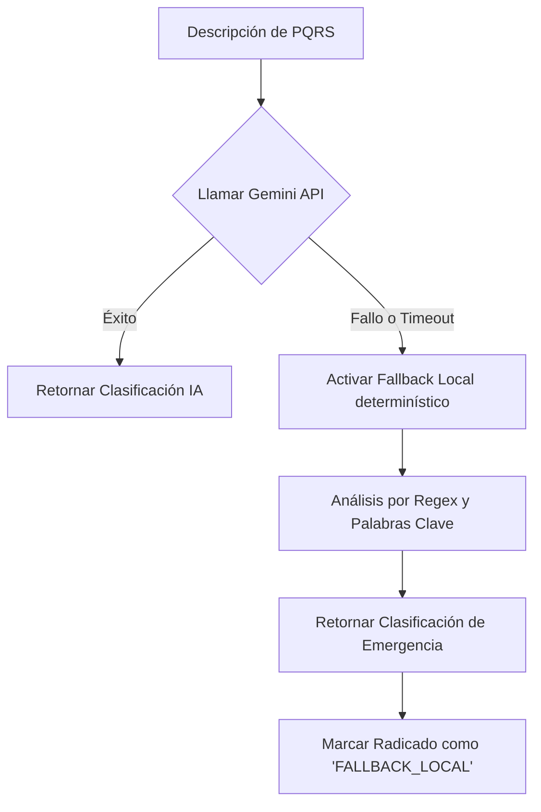

# Plan de Recuperación ante Desastres y Resiliencia Local
## Ventanilla Única Inteligente · Simacota

Este documento detalla los mecanismos de alta disponibilidad, tolerancia a fallos de servicios externos (resiliencia local) y las estrategias de respaldo y recuperación ante desastres (Disaster Recovery - DR) para garantizar la continuidad operativa de la administración municipal de Simacota.

---

## 1. Resiliencia de IA: Motores Locales de Fallback

La plataforma de Simacota está diseñada bajo la premisa de que los servicios cognitivos externos (como Google Gemini API) son susceptibles a caídas de latencia, superación de cuotas o interrupciones globales de red. Para mitigar esto, se implementaron mecanismos locales determinísticos de respaldo:



### 1.1. Clasificador Asistivo Local
Si `/api/ai/classify` detecta un error en la API de Gemini o excede un timeout crítico de `6000ms`, se ejecuta una función de contingencia local basada en un diccionario semántico estructurado de Simacota:
* **Mapeo Semántico Local**:
  * Palabras como *"tapa", "tubo", "agua", "daño acueducto", "vía", "hueco", "vertedero"* asocian automáticamente a **Planeación e Infraestructura**.
  * Palabras como *"seguridad", "ruido", "vecino", "pelea", "policía", "riña"* asocian automáticamente a **Secretaría de Gobierno**.
  * Palabras como *"sisben", "salud", "subsidio", "adulto mayor"* asocian a **Desarrollo Social**.
* **Efecto**: El radicado es ingresado con éxito y el flujo administrativo no se detiene bajo ninguna circunstancia.

### 1.2. Tolerancia del Asistente SIMI
En el Portal Ciudadano, si la API del chat de SIMI falla, el chat flotante no se congela ni genera un crash visual. Inyecta una respuesta empática del sistema local informando de la congestión y continúa permitiendo la radicación manual simple.

---

## 2. Continuidad del Estado en Cliente (Resistencia del Navegador)

Para evitar la pérdida de información en formularios largos en caso de desconexiones repentinas de red del ciudadano o del funcionario:
* **Persistencia en `sessionStorage`**: El chat de SIMI y las plantillas de copilotos guardan borradores automáticos de progreso en el almacenamiento local del navegador (`sessionStorage`). Re-cargar la página no destruye la información redactada, permitiendo al funcionario retomar de inmediato.

---

## 3. Plan de Respaldo y Restauración de Base de Datos (Firestore)

El activo de información más valioso del municipio son los documentos de `radicados` y su `trazabilidad`. Se establecen las siguientes políticas oficiales de DR:

### 3.1. Respaldos Automáticos Diarios (Backups)
Se programa una función nativa en Google Cloud Platform (GCP) para exportar diariamente la base de datos completa de Firestore a un bucket seguro de Google Cloud Storage (`gs://backups-ventanilla-simacota/`):
```bash
gcloud firestore export gs://backups-ventanilla-simacota/diario/
```

### 3.2. Proceso de Restauración ante Corrupción de Datos
Si se detecta una pérdida accidental o corrupción masiva de datos:
1. **Poner el panel administrativo en modo de lectura única** mediante un Feature Flag global (`MAINTENANCE_MODE = true`).
2. **Importar la última copia de seguridad válida**:
   ```bash
   gcloud firestore import gs://backups-ventanilla-simacota/diario/YYYY-MM-DD/
   ```
3. **Validar consistencia de los consecutivos** revisando el contador en `counters/radicados-{year}` antes de reabrir el acceso público.
