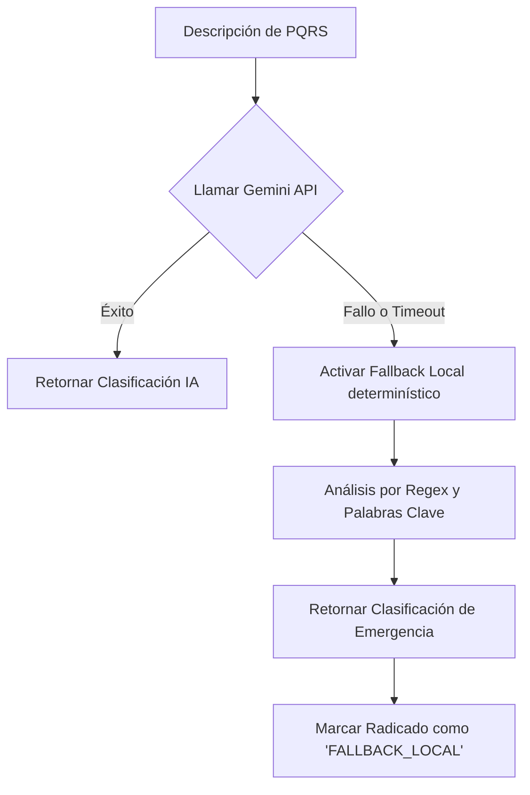

# Plan de Recuperación ante Desastres y Resiliencia Local
## Ventanilla Única Inteligente · Simacota

Este documento detalla los mecanismos de alta disponibilidad, tolerancia a fallos de servicios externos (resiliencia local) y las estrategias de respaldo y recuperación ante desastres (Disaster Recovery - DR) para garantizar la continuidad operativa de la administración municipal de Simacota.

---

## 1. Resiliencia de IA: Motores Locales de Fallback

La plataforma de Simacota está diseñada bajo la premisa de que los servicios cognitivos externos (como Google Gemini API) son susceptibles a caídas de latencia, superación de cuotas o interrupciones globales de red. Para mitigar esto, se implementaron mecanismos locales determinísticos de respaldo:



### 1.1. Clasificador Asistivo Local
Si `/api/ai/classify` detecta un error en la API de Gemini o excede un timeout crítico de `6000ms`, se ejecuta una función de contingencia local basada en un diccionario semántico estructurado de Simacota:
* **Mapeo Semántico Local**:
  * Palabras como *"tapa", "tubo", "agua", "daño acueducto", "vía", "hueco", "vertedero"* asocian automáticamente a **Planeación e Infraestructura**.
  * Palabras como *"seguridad", "ruido", "vecino", "pelea", "policía", "riña"* asocian automáticamente a **Secretaría de Gobierno**.
  * Palabras como *"sisben", "salud", "subsidio", "adulto mayor"* asocian a **Desarrollo Social**.
* **Efecto**: El radicado es ingresado con éxito y el flujo administrativo no se detiene bajo ninguna circunstancia.

### 1.2. Tolerancia del Asistente SIMI
En el Portal Ciudadano, si la API del chat de SIMI falla, el chat flotante no se congela ni genera un crash visual. Inyecta una respuesta empática del sistema local informando de la congestión y continúa permitiendo la radicación manual simple.

---

## 2. Continuidad del Estado en Cliente (Resistencia del Navegador)

Para evitar la pérdida de información en formularios largos en caso de desconexiones repentinas de red del ciudadano o del funcionario:
* **Persistencia en `sessionStorage`**: El chat de SIMI y las plantillas de copilotos guardan borradores automáticos de progreso en el almacenamiento local del navegador (`sessionStorage`). Re-cargar la página no destruye la información redactada, permitiendo al funcionario retomar de inmediato.

---

## 3. Plan de Respaldo y Restauración de Base de Datos (Firestore)

El activo de información más valioso del municipio son los documentos de `radicados` y su `trazabilidad`. Se establecen las siguientes políticas oficiales de DR:

### 3.1. Respaldos Automáticos Diarios (Backups) — OPERATIVO y VERIFICADO DE VERDAD (12-08-2026)

> **Corrección de un "verificado" que no lo era (12-ago-2026).** Esta sección
> declaraba el export "verificado" desde el 6-ago y el workflow venía en verde
> todos los días. Al revisar los logs apareció que el job marcaba SUCCESS
> **cuando la copia apenas había empezado**: `gcloud firestore export` retorna en
> cuanto la operación queda registrada — el log del 12-ago muestra
> `operationState: PROCESSING` y salida exitosa 4 segundos después, con el
> respaldo todavía en curso del lado de GCP. Si fallaba a mitad (cuota, permisos,
> indisponibilidad) **nadie se habría enterado**, y el verde diario daba una
> falsa tranquilidad. Corregido: el workflow ahora espera a que la operación
> llegue a `SUCCESSFUL` y además comprueba que el destino contenga objetos con
> bytes > 0, publicando el tamaño en el resumen para vigilar la tendencia.
>
> Lección: *un respaldo que nadie verifica no es un respaldo, es una promesa* — y
> el verde de un pipeline puede ser exactamente esa promesa.

**Estado (Roadmap P2.4):** el mecanismo de respaldo está **implementado y
versionado** en el repositorio. Antes esta sección describía un export
"programado" que no existía en ningún lado (hallazgo CR-3, auditoría 2026-07-20):
no había Cloud Scheduler, ni Action, ni script. Ya no es así.

**Qué quedó AUTOMATIZADO (en el repo, listo para activar):**
- Workflow `.github/workflows/backup-firestore.yml` — export diario de Firestore
  de producción a `gs://ventanilla-simacota-backups/diario/YYYY-MM-DD/`, a las
  02:00 hora Colombia (07:00 UTC), más disparo manual de prueba.
- `scripts/backups/setup-gcp-backups.sh` — provisión idempotente: habilitación de
  las APIs requeridas (`iamcredentials`/`iam`/`firestore`/`storage`), bucket,
  retención (30 días vía lifecycle), service account de backups, IAM mínimo y
  federación de identidad (WIF) opcional.
- `scripts/backups/export-firestore.sh` — export manual equivalente para correr
  desde una máquina con `gcloud`.

El comando de fondo (lo ejecuta el workflow; la fecha la estampa el runner):
```bash
gcloud firestore export gs://ventanilla-simacota-backups/diario/$(date -u +%F) \
  --project=ventanilla-unica-f31b1 --database='(default)'
```

**Qué es MANUAL / acción del propietario (una sola vez):**
- Ejecutar `setup-gcp-backups.sh` (requiere `gcloud` como Owner/Editor del proyecto).
- Cargar los secrets/variables en GitHub (WIF recomendado, o clave JSON). Detalle
  en `scripts/backups/README.md` y `VARIABLES_ENTORNO.md`.
- Hasta que esos secrets existan, el workflow **falla con un mensaje claro**
  ("infraestructura sin provisionar") en lugar de fingir que respalda.

**Estado verificado 2026-08-06:** los backups están **OPERATIVOS**. Primer export
manual verificado (GitHub Actions run `31088181768`, `success`) en
`gs://ventanilla-simacota-backups/diario/2026-08-06/` (`overall_export_metadata` +
`output-0/1`); tamaño del export ≈ **361 KB**. El aprovisionamiento requirió —además
de `setup-gcp-backups.sh` + los secrets WIF— habilitar `iamcredentials.googleapis.com`
(necesaria para la impersonación WIF). El primer intento (run `31087985656`) falló con
`403 SERVICE_DISABLED` y la API se activó a mano; ese hueco **ya está cerrado en el
script** (PR #152): `setup-gcp-backups.sh` habilita esa API —y `iam`/`firestore`/
`storage`— ANTES de crear SA/IAM/WIF, de modo que una provisión limpia queda completa
en una sola pasada. Con ≥1 export
durable verificado, la precondición de backup para el reset de producción queda
**cumplida** (el reset sigue requiriendo tu orden explícita).

**Por qué GitHub Actions y no Cloud Scheduler:** justificación en
`scripts/backups/README.md`. Resumen: la config queda versionada (raíz del
hallazgo CR-3), una sola superficie operativa (la de CI), y estampado por día
sin infraestructura extra.

**Salvedad:** los workflows programados de GitHub se auto-deshabilitan tras
60 días sin `push` al repo. En mantenimiento activo no aplica; si el repo entra
en pausa larga, hay que reactivar el workflow o migrar el disparo a Cloud
Scheduler (+ Cloud Function para plantillar la fecha).

**Hardening de la base (verificado en prod el 2026-08-06 vía `gcloud firestore
databases describe`):** PITR y Delete Protection están **HABILITADOS** —
`POINT_IN_TIME_RECOVERY_ENABLED` (retención 7 días, `versionRetentionPeriod:
604800s`, ventana desde 2026-07-30) y `DELETE_PROTECTION_ENABLED`. Esto **corrige**
el estado anterior de este documento, que los daba por deshabilitados (snapshot del
2026-07-20, previo a su activación). **PITR no es un backup:** es una ventana de
recuperación de 7 días *dentro de la misma base* (útil ante corrupción reciente),
**complementaria** al export durable a GCS, no un sustituto. Ver
`docs/RUNBOOK_RESTAURACION.md` §7.

### 3.2. Proceso de Restauración ante Corrupción de Datos

El procedimiento **exacto, con criterios de éxito** vive en
`docs/RUNBOOK_RESTAURACION.md`. El drill end-to-end contra un export real de
producción se **ejecutó con éxito el 18-ago-2026** (corrida
[`32087393598`](https://github.com/robinsongalvis/ventanilla.simacota/actions/runs/32087393598)):
el respaldo del 17-ago se restauró en una base desechable de stage y se
verificó su contenido. Desde esa fecha el respaldo del municipio es
**probado**, no supuesto. Resumen:

1. Toda restauración de *ensayo* va a **STAGE** (`ventanilla-simacota-stage`),
   nunca a producción.
2. Ante corrupción real: **congelar escritura** (modo mantenimiento), restaurar
   primero a stage para validar el backup, y solo entonces importar a producción
   **con orden explícita del propietario**:
   ```bash
   gcloud firestore import gs://ventanilla-simacota-backups/diario/YYYY-MM-DD \
     --project=ventanilla-unica-f31b1 --database='(default)'
   ```
3. **Validar consistencia de los consecutivos** con el detector de solo lectura
   `scripts/laboratorio/detectar-consecutivos-fantasma.mjs` (cuenta documentos y
   verifica unicidad + continuidad, AGN 060/2001) antes de reabrir el acceso.
