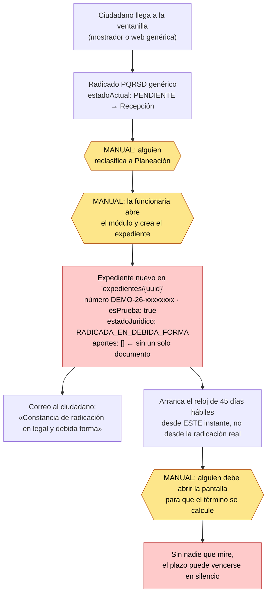

# Auditoría — ¿el módulo de Licencias de Construcción ya radica automáticamente?

**Fecha:** 24 de agosto de 2026
**Alcance:** módulo Licencias de Construcción (Secretaría de Planeación)
**Método:** inspección del código en ejecución. Cinco bloques auditados en paralelo y **cada
veredicto positivo sometido a un segundo revisor cuyo único encargo era tumbarlo.** La regla
aplicada fue la del cliente: *si no se puede señalar el código, el veredicto es NO*; la
documentación, los comentarios y los nombres de función no cuentan como evidencia.
**Naturaleza:** solo diagnóstico. No se construyó ni se propuso nada.

> **Nota sobre el conteo.** El encargo hablaba de 25 puntos; la lista tiene 26 (A=5, B=6, C=3,
> D=8, E=4). Además el bloque C se desdobló en 8, porque **radicados y expedientes de licencias
> son mecanismos distintos** y mezclarlos habría producido un veredicto falso. Total: **31**.

---

## 1. Tabla resumen

`⬇` marca los veredictos **degradados** al ser atacados por el refutador. Son cuatro, y esa
cifra es en sí un dato: un informe de una sola pasada habría reportado tres `SÍ` de más.

| # | Pregunta | Veredicto |
|---|---|---|
| A1 | ¿Hay checklist de documentos POR MODALIDAD (obra nueva, ampliación, demolición, reconoci | **NO** |
| A2 | ¿El checklist está en DATOS (colección Firestore configurable por un administrador) o HA | **NO** |
| A3 | ¿El sistema BLOQUEA el envío si falta un documento obligatorio, o solo advierte y deja p | **NO** |
| A4 | ¿Hay ítems condicionales (p. ej. poder solo si es apoderado)? Si los hay, ¿la condición  | PARCIAL |
| A5 | ¿Los archivos suben de verdad a Firebase Storage con ruta AISLADA por tenantId y por exp | PARCIAL |
| B1 | Cuando el ciudadano termina de cargar y envía, ¿en qué ESTADO queda el trámite? Valor ex | **NO** |
| B2 | ¿Existe verificación de completitud por un funcionario? ¿Documental o juicio sobre el CO | **NO** ⬇ (era PARCIAL) |
| B3 | LA CENTRAL: al aprobarse la verificación, ¿la radicación ocurre AUTOMÁTICAMENTE por códi | **NO** |
| B4 | ¿Dónde vive el trámite radicado: mismo documento o registro nuevo? ¿Quién sincroniza y q | PARCIAL |
| B5 | ¿La radicación corre dentro de una TRANSACCIÓN de Firestore o son escrituras sueltas? | PARCIAL |
| B6 | ¿Es IDEMPOTENTE? Doble clic o reintento de red: ¿dos números de radicado? | PARCIAL |
| C1 | ¿Cómo se genera el consecutivo de RADICADOS? ¿Contador transaccional, Date.now(), UUID,  | PARCIAL ⬇ (era SI) |
| C1b | ¿Cómo se genera el número de EXPEDIENTE de licencias? | **NO** |
| C2 | Dos RADICADOS en el mismo segundo: ¿colisionan o se saltan un número? | PARCIAL |
| C2b | Dos EXPEDIENTES de licencias en el mismo segundo: ¿colisionan? | PARCIAL ⬇ (era SI) |
| C3 | ¿El consecutivo de RADICADOS reinicia por año y respeta el formato de la entidad? | PARCIAL |
| C3b | ¿El consecutivo de EXPEDIENTES reinicia por año y respeta el formato de la entidad (6874 | **NO** |
| C4 | ¿Hay un interruptor que haga que los expedientes salgan con numeración de demostración e | **SÍ** |
| C5 | ¿Está cableado el emisor real de números de expediente (contador transaccional + reserva | **NO** |
| D1 | ¿Existe cálculo de términos en el módulo de Licencias (45 días, Decreto 1077)? | **SÍ** |
| D2 | ¿Días HÁBILES o CALENDARIO? ¿Excluye sábados, domingos y festivos colombianos? | **SÍ** |
| D3 | ¿De dónde salen los festivos: tabla propia, librería, o están asumidos? | PARCIAL |
| D4 | La fecha que arranca el conteo, ¿se escribe con serverTimestamp() de Firebase o con la h | PARCIAL |
| D5 | ¿El conteo arranca en la RADICACIÓN o en otro evento? | PARCIAL |
| D6 | ¿Hay suspensión de términos por acta de observaciones y correcciones? ¿Y prórroga? | PARCIAL |
| D7 | ¿Hay alertas ANTES del vencimiento? ¿Job programado o solo al abrir la pantalla? | **NO** |
| D8 | ¿Puede un funcionario EDITAR a mano la fecha de radicación o el contador de días desde a | **NO** |
| E1 | Después de radicado, ¿se pueden REEMPLAZAR o BORRAR los documentos cargados? (storage.ru | PARCIAL |
| E2 | ¿Hay bitácora de eventos por expediente (quién, cuándo, qué transición, por qué)? ¿Es de | PARCIAL |
| E3 | ¿Los cambios de estado pasan por una función validada EN SERVIDOR, o la interfaz escribe | PARCIAL ⬇ (era SI) |
| E4 | ¿El ciudadano puede consultar su radicado en /consulta y ver la FECHA DE RADICACIÓN y lo | PARCIAL |
**Recuento: 3 SÍ · 17 PARCIAL · 11 NO.**

Y los tres únicos `SÍ` conviene leerlos con cuidado: **C4** confirma que existe un interruptor de
numeración de demostración —es un «sí» a que el problema existe—, y **D1/D2** confirman que el
cálculo de los 45 días hábiles está bien escrito. Ningún `SÍ` corresponde a una capacidad
operativa del módulo.

### Veredictos degradados por el refutador

| # | De | A | Motivo |
|---|---|---|---|
| B2 | PARCIAL | **NO** | No hay control parcial de completitud: no hay ninguno. |
| C1 | SÍ | PARCIAL | El contador transaccional es el de *radicados*; los *expedientes* no lo usan. |
| C2b | SÍ | PARCIAL | La ausencia de colisión viene del azar de un UUID, no de una reserva de unicidad. |
| E3 | SÍ | PARCIAL | La interfaz no escribe el estado, pero la validación de servidor no cubre todos los caminos. |

---

## 2. El flujo que hoy ejecuta el código

No es el flujo deseado. Es el que está escrito.

**Las tres cajas ámbar son intervención humana obligatoria.** Ninguna está automatizada, y la
tercera es la más peligrosa porque no es una tarea que alguien tenga asignada: es una pantalla
que hay que abrir para que la cuenta ocurra.

**Lo que el diagrama no muestra porque no existe:** no hay ninguna caja «el ciudadano carga sus
documentos de licencia». Las ocho rutas del módulo exigen sesión de funcionario, y la búsqueda
en el portal ciudadano (`app/radicacion/`, `app/consulta/`, `app/api/public/`) no arroja una sola
referencia a licencias o expedientes.

---

## 3. La respuesta a la pregunta del cliente

> **No. Y el problema es más profundo que un paso manual: hoy el módulo de Licencias no radica
> en absoluto** — no existe evento de aprobación de verificación, no existe flujo del ciudadano,
> y el número que emite no es de la serie legal sino un `DEMO-26-xxxxxxxx` marcado como prueba.

Entre la validación y la radicación no hay «un botón de más»: **no hay nada que pulsar, porque no
hay radicación que disparar.**

---

## 4. Los tres huecos más graves, por riesgo jurídico

### 1º — El plazo puede vencerse sin que nadie se entere: silencio administrativo positivo

Ningún trabajo programado vigila los expedientes de licencias. Los tres crons declarados en
`vercel.json` miran `ventanilla_radicados` (el reloj de PQRSD) o son de infraestructura; el único
lector de la colección `expedientes` en toda la aplicación es una pantalla. El cálculo del término
**solo ocurre cuando un humano abre el expediente**, y se evalúa con el reloj del navegador.

En licencias urbanísticas, el vencimiento del término no es una demora: es la **concesión de la
licencia por silencio administrativo positivo**. Un equipo con la fecha mal configurada puede
además pintar «en término» un expediente ya vencido.

### 2º — El sistema certifica por escrito un hecho que nunca verificó

Todo expediente nace con `estadoJuridico: RADICADA_EN_DEBIDA_FORMA` y, en la misma estructura,
`aportes: []` — cero documentos. Ese estado es, según el propio código, el hito que **afirma que
la solicitud se presentó con la documentación completa verificada** (art. 2.2.6.1.2.1.1 par. 1) y
el que **ancla el término**. Acto seguido se envía al ciudadano una *«Constancia de radicación en
legal y debida forma»*.

El checklist existe pero no es un control: se evalúa **en el navegador**, su único efecto es una
etiqueta de color, y ningún botón se deshabilita con él. En el servidor no hay ninguna ruta que
consulte la completitud.

Agravante que corre el reloj en contra del ciudadano: el término arranca **cuando la funcionaria
abre el expediente**, no cuando el ciudadano radicó. Los días intermedios se le descuentan a él y
se le regalan a la Administración, y el sistema los presenta como el término correcto.

### 3º — A toda modalidad se le aplica el checklist de obra nueva

Existe **un solo** checklist, y no es genérico: es el de obra nueva, con 19 requisitos fijos,
asignado literalmente a todo expediente sin mirar lo que el funcionario eligió. Las nueve
modalidades están catalogadas en el código pero **no tienen un solo consumidor**.

En la práctica: a una demolición, una subdivisión o un reconocimiento se le exigen papeles que su
modalidad no requiere —causal de reclamo— y **no** se le exigen los suyos. El correo al ciudadano
le dice «licencia de construcción · obra nueva» aunque haya radicado otra cosa.

---

## 5. Cuánto del plan está realmente cubierto

La distinción que importa: **está construido el motor, no está conectado el trámite.**

| Capa | Estado real |
|---|---|
| Modelo, tipos y contratos del motor de expedientes | Construido y con pruebas |
| Máquina de estados jurídicos y transiciones | Construida; solo dos destinos alcanzables |
| Cálculo del término de 45 días hábiles | **Bien construido** — días hábiles y festivos correctos |
| Bitácora de actuaciones (append-only, actor del servidor) | Construida y sólida |
| Aislamiento y reglas de acceso | Cerrado: bucket y colección Admin-SDK-only |
| Emisor real de números de expediente | **Escrito y probado, pero sin un solo llamador** |
| Checklist por modalidad | No existe |
| Compuerta de completitud en servidor | No existe |
| Flujo del ciudadano | No existe |
| Vigilancia programada del plazo | No existe |

La lectura honesta: lo difícil —la corrección jurídica del término, la trazabilidad, el
aislamiento, la reserva transaccional de consecutivos— **ya está escrito y probado**. Lo que falta
es, en su mayoría, **cableado**: conectar el emisor real que ya existe, poner la compuerta de
completitud en el servidor, parametrizar el checklist por modalidad, abrir la puerta al ciudadano
y programar la vigilancia del plazo.

Eso es una buena noticia y una mala. La buena: no hay que rehacer los cimientos. La mala: **un
motor sin cablear no es un módulo a medio hacer, es un módulo que no funciona** — y hoy presenta
como radicación algo que no lo es.

---

*Auditoría generada por inspección del código en `main`. Cada veredicto positivo fue sometido a
refutación adversarial; los cuatro degradados están señalados en §1.*
