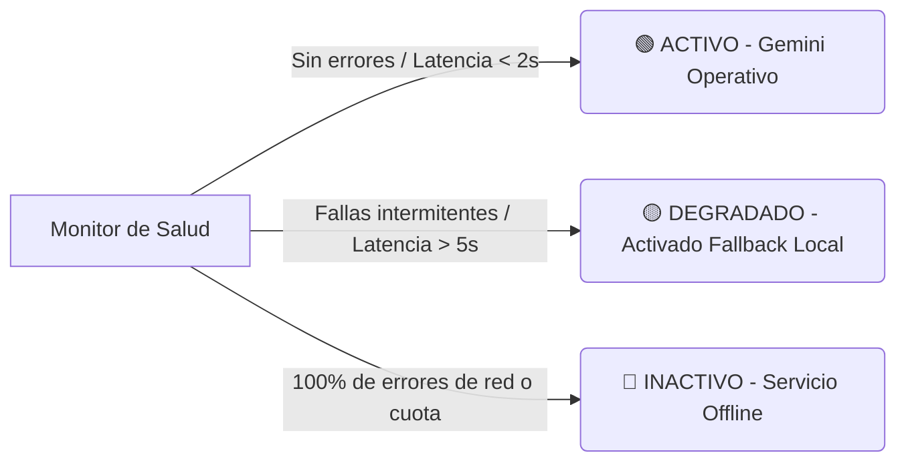

# Manual de Observabilidad y Telemetría de IA
## Ventanilla Única Inteligente · Simacota

Este manual detalla los mecanismos de observabilidad implementados en la plataforma para auditar el desempeño de los modelos de lenguaje, registrar latencias de peticiones, capturar fallas técnicas de infraestructura y monitorear el estado de salud de la capa cognitiva del municipio.

---

## 1. Colección de Telemetría Técnica: `ai_logs`

Todas las operaciones que interactúan con la capa de inteligencia artificial (clasificación, chat de SIMI y copilotos de secretarías) generan registros de telemetría estructurados de forma asíncrona en la colección `/ai_logs/{logId}` de Firestore.

### 1.1. Esquema del Registro de Telemetría
Cada documento en `ai_logs` contiene el siguiente esquema descriptivo:

```typescript
interface AILog {
  logId: string;         // Identificador único (auto-generado por Firestore)
  tipo: 'CLASSIFY' | 'CHAT' | 'COPILOT'; // Canal o módulo que gatilla la telemetría
  timestamp: Date;       // Fecha y hora exacta de la transacción
  latenciaMs: number;    // Tiempo total de respuesta del modelo en milisegundos
  estado: 'SUCCESS' | 'ERROR' | 'FALLBACK_LOCAL'; // Resultado de la operación
  modelo: string;        // Nombre del modelo utilizado (ej: 'gemini-2.5-flash')
  tokensUtilizados?: {
    prompt: number;      // Cantidad de tokens en la consulta
    completion: number;  // Cantidad de tokens en la respuesta generada
    total: number;       // Sumatoria total de tokens
  };
  errorMsg?: string;     // Detalle técnico de la excepción en caso de falla
}
```

### 1.2. Propósito y Análisis de Datos
Estos logs permiten a los administradores de TI del municipio:
* Identificar picos de latencia en la red nacional o en los servidores de Google.
* Monitorear el consumo mensual de tokens para la planeación presupuestaria.
* Detectar tasas inusuales de fallos que requieran intervención en la configuración.

---

## 2. Monitor Visual de Salud Algorítmica: *AI Health Status*

El Panel de Supervisión Administrativa incorpora un indicador de salud semáforo en tiempo real para reportar el estado de conectividad e infraestructura cognitiva:



* **🟢 ACTIVO (Verde)**: Gemini API responde de forma óptima con latencias ordinarias. El ecosistema funciona al 100% de sus capacidades semánticas avanzadas.
* **🟡 DEGRADADO (Amarillo)**: La plataforma detecta picos de latencia inusuales o fallas aleatorias resueltas exitosamente mediante el *Motor Local de Fallback* (Regex/Keywords).
* **🔴 INACTIVO (Rojo)**: La API de Gemini está fuera de servicio o la cuota municipal ha sido totalmente agotada. El sistema opera enteramente en modo determinístico local.

---

## 3. Logs de Operación Administrativa: `ai_auditoria`

A diferencia de `ai_logs` (que almacena telemetría estrictamente técnica), la colección `ai_auditoria` captura eventos operativos donde el funcionario humano corrige o complementa las sugerencias algorítmicas (Overrides). Esto constituye la bitácora institucional de gobernanza que valida la supervisión humana sobre la máquina.

---

## 4. Observabilidad de Flujos Institucionales (ADR-0005, Ola 1)

Además de la telemetría de IA (`ai_logs`), los cuatro flujos críticos del ciclo
del trámite emiten un **evento de negocio estructurado** al completarse (éxito o
fallo), para que la confiabilidad sea medible (habilita el KPI #3 de la Fase 3 y
el auditor de rendimiento de la Ola 2).

- **Primitivo:** `lib/observabilidad/eventos-negocio.ts` → `registrarEventoNegocio()`.
  Emite a stdout como JSON one-liner (`[ventanilla:evento-negocio]`) + breadcrumb
  Sentry best-effort. Nunca lanza; sin persistencia en Firestore.
- **Flujos instrumentados:** radicación (`app/api/radicacion`), asignación,
  prórroga y respuesta (`app/api/radicados/[radicadoId]/{asignar,prorroga,resolver}`).
- **Campos del evento:** `operacion`, `resultado` (ok|error), `latenciaMs`,
  `correlacion` (radicadoId + timestamp), `actorRol`, `tenant`, `radicadoId`,
  `timestamp`, y `mensaje` **solo en error** (saneado con `sanitizarTextoObservabilidad`).
- **PII:** el evento no tiene campos de identidad del ciudadano; revisión cruzada
  de seguridad **CONFORME**. Riesgo residual conocido y aceptado: un nombre propio
  en claro dentro de un `Error.message` (limitación heredada de `logError`, H-N03).
- **Control de regresión:** `__tests__/eventos-negocio.test.ts` (forma del evento,
  ausencia de PII, un caso por flujo).
