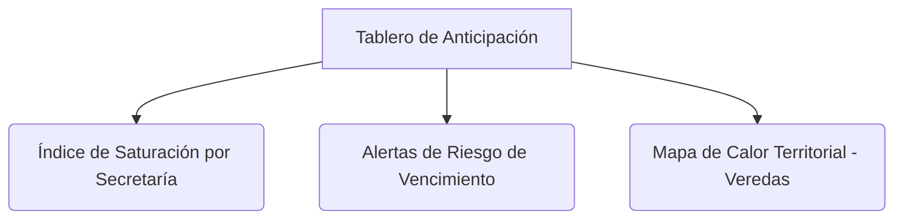

# Guía de Onboarding para Funcionarios Públicos
## Ventanilla Única Inteligente · Simacota

Bienvenido a la **Ventanilla Única Inteligente de Simacota**, la plataforma de gestión que transforma la atención al ciudadano y la planeación operativa de nuestra alcaldía mediante inteligencia artificial. Este manual le guiará en el uso diario de las dos herramientas más potentes del sistema: el **Panel de Anticipación Operativa** y el **Copiloto de Inteligencia Artificial**.

---

## 1. El Panel de "Anticipación Operativa" 📊

Ubicado en el menú administrativo principal, este panel no es un simple reporte visual; es el **cerebro analítico preventivo** del municipio. Le permite anticiparse a cuellos de botella y priorizar el trabajo diario según riesgos matemáticos reales.

### ¿Cómo interpretar los indicadores clave?
1. **Índice de Saturación ($I_{sat}$)**: Representa la carga de trabajo actual de su dependencia frente a su capacidad operativa real. Si ve un porcentaje superior al `80%` (en **Rojo**), coordine con su equipo traslados rápidos o solicite apoyo de despacho para descongestionar la secretaría.
2. **Probabilidad de Vencimiento ($P_{venc}$)**: La IA analiza la complejidad sintáctica de la solicitud y los tiempos históricos de respuesta. Un radicado en estado de "Riesgo Alto" requiere su atención prioritaria hoy mismo, incluso si su fecha límite formal parece lejana.
3. **Territorialización de Alertas**: Identifique de qué veredas o corregimientos (ej: *Vereda Santa Cruz, Corregimiento La Llanera*) provienen la mayoría de quejas. Esto le permite programar visitas técnicas o mesas de trabajo de forma focalizada.

---

## 2. El Copiloto de Inteligencia Artificial (✦ Copiloto IA)

Cuando abre el detalle de cualquier trámite asignado a su secretaría, encontrará una pestaña destacada llamada **"Copiloto IA ✦"**. Esta herramienta actúa como su asistente técnico de redacción de respuestas y validación operativa.

### ¿Cómo trabajar de la mano con el Copiloto?
1. **Checklist Operativa Sugerida**: La IA lee el asunto y genera una lista de verificación con los documentos técnicos o de ordenamiento territorial (EOT) que usted debe revisar antes de proyectar la respuesta oficial.
2. **Generación de Borrador Técnico**: Con un solo clic, el copiloto redactará una propuesta de respuesta oficial basada en las particularidades del radicado, manteniendo un lenguaje formal, claro y respetuoso.
3. **Flujo de Respuesta Rápido**:
   * **Revisar y Editar**: Lea el borrador redactado por el copiloto.
   * **Modificar**: Ajuste cualquier término técnico, norma legal local o fecha directamente en el editor interactivo.
   * **Adoptar Borrador**: Al dar clic en *"Adoptar Borrador"*, el texto corregido se inyectará automáticamente en el campo de respuesta formal, y la plataforma le trasladará directamente a la pestaña de radicación de respuesta o solicitud de prórroga para finalizar el trámite en segundos.

---

## 3. Sus Deberes en la Gobernanza del Sistema

Recuerde que el sistema aprende de sus decisiones diarias:
* **Votación de Calidad**: Si la sugerencia de oficina o el borrador redactado fue de gran utilidad, presione el botón 👍. Si la clasificación de la IA falló o no fue útil, presione ❌.
* **Traslados Correctivos**: Si un radicado le llega por error semántico de la IA y debe enviarlo a otra dependencia, ejecute el traslado normal. El sistema detectará la corrección (*override*) de forma transparente y la registrará para afinar la precisión algorítmica general del municipio en futuras actualizaciones.
