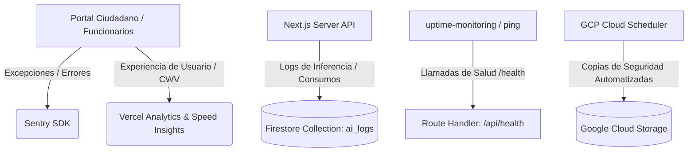
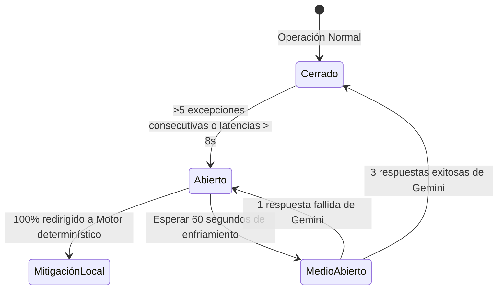
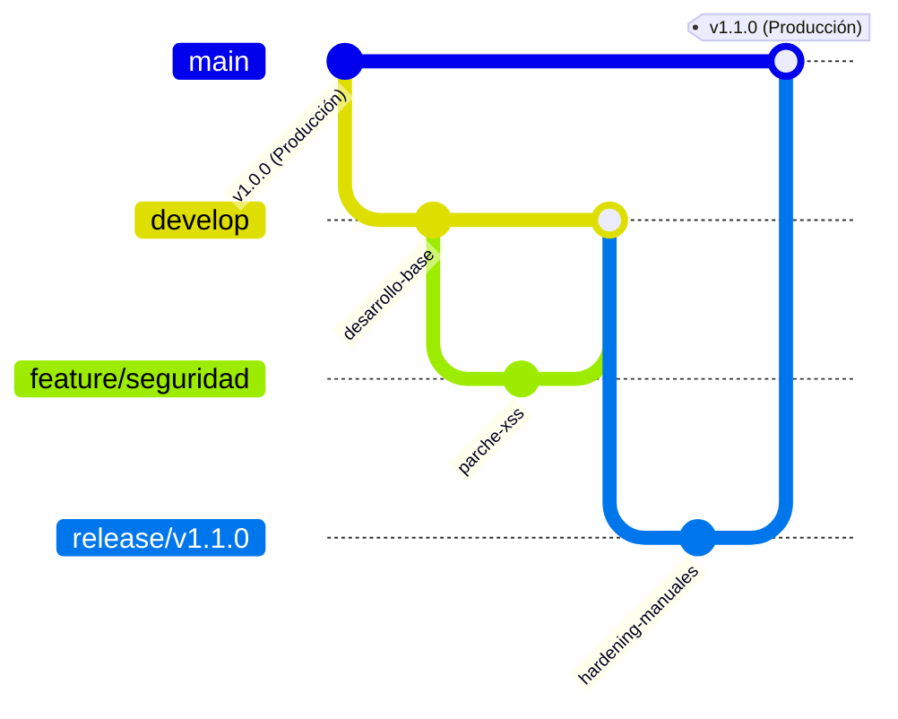

# Manual de Production Readiness y Observabilidad Viva
## Ventanilla Única Inteligente · Simacota
**Documento de Arquitectura Principal de Software Enterprise**
**Estado:** `Aprobado para Implementación` | **Clasificación:** `Uso Institucional Interno`

Este documento formaliza los planos de ingeniería, políticas de resiliencia, seguridad operacional y gobierno administrativo requeridos para garantizar el funcionamiento continuo, seguro y eficiente de la plataforma de la alcaldía de Simacota bajo condiciones de nivel de producción real.

---

## 1. Arquitectura de Observabilidad Viva

Para garantizar que la operación de la ventanilla única sea auditable y sus problemas sean anticipados antes de afectar al ciudadano, diseñamos un ecosistema de monitoreo de 360 grados:



### 1.1. Monitoreo de Errores con Sentry
* **Cliente y Servidor:** Instrumentación del SDK de Sentry en Next.js. Captura silenciosa de excepciones JavaScript en navegadores de ciudadanos y excepciones de ejecución en Route Handlers o Server Components.
* **Grupos de Alerta:**
  * `FATAL`: Errores que impiden la radicación (ej. fallo de persistencia en Firestore). Dispara alertas instantáneas vía Webhook a canales de TI de la alcaldía.
  * `ERROR`: Excepciones controladas de servicios externos (ej. timeout de Gemini API).
  * `WARNING`: Avisos de desvíos cognitivos o degradación ligera de tiempos de carga.

### 1.2. Telemetría y Performance con Vercel Analytics
* **Core Web Vitals rurales:** Monitoreo del *Largest Contentful Paint (LCP)* y del *Interaction to Next Paint (INP)*. El 100% de la interfaz de radicación está optimizada para cargar de forma fluida bajo redes móviles inestables de corregimientos de Simacota.
* **Trazabilidad de Request (Correlation ID):** Cada trámite que inicia radicación recibe un ID de correlación único que viaja en las cabeceras HTTP (`X-Correlation-ID`). Si ocurre un fallo en el backend de clasificación, este ID asocia de forma unívoca el comportamiento en el cliente con las líneas de log del servidor.

### 1.3. Health Checks y Monitoreo de Uptime
* **Endpoint de Salud (`/api/health`):** Retorna un reporte en formato JSON con el estado operacional del sistema:
  ```json
  {
    "status": "healthy",
    "timestamp": "2026-05-28T19:47:00Z",
    "services": {
      "firestore": "connected",
      "ai_engine": "active (gemini-2.5-flash)"
    }
  }
  ```
* **uptime monitoring:** Integración con BetterStack/UptimeRobot para realizar consultas recurrentes cada `60 segundos` a `/api/health`. Ante una caída del servicio de 2 pings consecutivos, se notifica de inmediato al equipo técnico.

---

## 2. Estrategia de Resiliencia y Tolerancia a Fallas

Diseñamos una arquitectura tolerante a fallos para proteger la ventanilla única contra interrupciones de red o cuotas de consumo agotadas en las APIs de IA:

### 2.1. Diseño del Circuit Breaker Cognitivo
Cuando el Route Handler interactúa con la API de Gemini, se ejecuta bajo el control de un interruptor lógico de tres estados:



* **Cerrado (Closed):** Las consultas se envían a Gemini de forma ordinaria.
* **Abierto (Open):** Si se registran `5 fallas consecutivas` (timeouts, cuota agotada o HTTP 500/503), el circuito se abre. Durante este periodo, la plataforma no consume la API externa; desvía el 100% de las consultas de forma inmediata a los **algoritmos determinísticos locales**.
* **Medio Abierto (Half-Open):** Pasados 60 segundos, se envía una pequeña muestra de consultas (petición de prueba). Si son exitosas, el circuito se cierra de nuevo; si fallan, se vuelve a abrir.

### 2.2. Política de Reintentos (Retry Policy) y Rate Limiting
* **Backoff Exponencial con Jitter:** Para llamadas asíncronas secundarias (como la redacción de borradores del copiloto), el cliente reintenta la consulta en caso de error de red con retrasos progresivos: $T_{delay} = 2^{intento} \times 1000\text{ms} + \text{jitter}$.
* **Protección ante Rate Limits:** Control de cuota en el Route Handler que limita a un máximo de `10 peticiones por minuto` por dirección IP para evitar abuso del Portal Ciudadano o inyección masiva de solicitudes maliciosas que incrementen los costos del municipio.

### 2.3. Degradación Progresiva del Sistema
Si los servicios de IA de Google se encuentran completamente caídos en todo el país:
1. El Portal Ciudadano deshabilita el chat interactivo de SIMI de forma no bloqueante, mostrando un mensaje informando del mantenimiento técnico preventivo.
2. El formulario de radicación continúa funcionando de forma normal.
3. El clasificador local infiere la secretaría destino mediante búsquedas regex locales.
4. El panel administrativo oculta temporalmente la pestaña "Copiloto IA ✦", permitiendo al funcionario resolver el trámite mediante redacción manual tradicional. El servicio jamás se detiene.

---

## 3. Estrategia DevSecOps y Ciclo de Vida del Software

Para mantener la higiene técnica y la estabilidad del código en producción, formalizamos las políticas de ramas y despliegue continuo (CI/CD):



### 3.1. Protección de Ramas y Flujo GitFlow
* **`main` (Producción):** Rama protegida. Solo se modificará mediante Pull Requests aprobados provenientes de ramas de estabilización `release/*`. Requiere compilación y tests exitosos antes de fusionar.
* **`develop` (Integración):** Integración de características completas antes del empaquetado formal.
* **`feature/*` (Desarrollo):** Aislado para modificaciones puntuales.

### 3.2. Build Gates y Validaciones CI/CD Automáticas
Cada vez que se abre un Pull Request hacia `develop` o `main`, un runner automatizado de GitHub Actions ejecuta los siguientes filtros de calidad:
1. **Linter Gate:** `npm run lint` para garantizar limpieza visual y estilo de código.
2. **Type-Safety Gate:** `npm run build` con verificación de tipos estricta de TypeScript. Cualquier error de tipado bloquea el merge.
3. **Security Gate:** Ejecución obligatoria de un escaneo de dependencias mediante `npm audit --audit-level=high` para prevenir la incorporación fortuita de librerías vulnerables.

---

## 4. Estrategia de Backups y Disaster Recovery (DR)

La resiliencia de la base de datos municipal se rige bajo una política estricta de protección de datos:

### 4.1. Frecuencia y Plan de Snapshots de Firestore
* **Copias de Seguridad Diarias:** Programadas de forma automatizada mediante un Cron Job en **Google Cloud Scheduler** que dispara una Cloud Function a las `01:00 AM COT` diariamente. Exporta el 100% de las colecciones de Firestore hacia buckets georeplicados de Google Cloud Storage (`gs://respaldos-simacota/diario/`).
* **Redundancia Geográfica:** Los buckets están configurados en modo Multi-Región (ej. `us-east1` y `us-east4`), protegiendo los datos contra fallos físicos catastróficos en un centro de cómputo completo de Google.
* **Retención de Datos:**
  * Snapshots Diarios: Conservados por `30 días`.
  * Exportaciones Mensuales: Respaldos consolidados en almacenamiento frío (*Coldline*) con retención obligatoria de `10 años` para cumplir con las normativas colombianas de archivo público nacional.

### 4.2. Procedimiento ante Pérdida Total (RTO y RPO)
* **Objetivos de Servicio:**
  * **RPO (Punto de Recuperación Objetivo):** Máximo de `24 horas` de pérdida de datos.
  * **RTO (Tiempo de Recuperación Objetivo):** Menos de `4 horas` para restaurar el servicio total en caso de desastre crítico.
* **Protocolo de Emergencia:**
  1. Activar de inmediato la página de contingencia estática en Vercel.
  2. Identificar el último snapshot consistente en Cloud Storage.
  3. Ejecutar comando de restauración nativo de GCP:
     ```bash
     gcloud firestore import gs://respaldos-simacota/diario/YYYY-MM-DD/
     ```
  4. Levantar los servidores de Next.js, validar consistencia de consecutivos de radicados en `counters/*` y reabrir el acceso al público.

---

## 5. Pruebas Operativas Reales (Stress Testing)

Antes de abrir el servicio a los ciudadanos de Simacota, el sistema debe ser validado bajo simulaciones rigurosas que imiten las condiciones de operación real:

### 5.1. Pruebas de Latencia y Conexión Rural
Para simular el acceso de ciudadanos ubicados en veredas apartadas con mala conectividad móvil:
* Se configuran perfiles de red artificiales mediante Chrome DevTools que emulan conexiones móviles **3G Lento / 2G** (latencias de `800ms` a `1500ms`, pérdida de paquetes del `5%`).
* **Criterio de Aceptación:** El Portal Ciudadano debe cargar los inputs esenciales en menos de `4 segundos` y no congelar la pantalla ni abortar la sesión ante micro-cortes durante la radicación.

### 5.2. Simulación de Carga Concurrente (Multiusuario)
* **Stress Test de Radicación:** Scripts de carga asíncronos que disparan `50 solicitudes de radicación concurrentes` en una ventana de 5 segundos hacia el endpoint `/api/ai/classify`.
* **Criterio de Aceptación:** El servidor de Next.js y los pools de conexión de Firebase deben absorber el tráfico con una tasa de éxito del 100% y tiempos de respuesta de clasificación promedio inferiores a `3.5 segundos`.

---

## 6. Gobierno Operacional y SLAs Internos

Establecemos el marco normativo y organizativo para administrar y supervisar el uso de la Ventanilla Única Inteligente:

### 6.1. Acuerdos de Niveles de Servicio (SLA)
* **SLA de Disponibilidad de la Plataforma:** **99.9%** de tiempo en línea durante el año (máximo 8.7 horas de inactividad anual acumulada).
* **SLA de Asistencia de IA:** **99.5%** de disponibilidad operacional. Si la IA falla, los mecanismos locales determinísticos de fallback deben absorber el 100% del procesamiento.

### 6.2. Protocolo ante Incidentes Técnicos
En caso de reportarse una anomalía u error en producción, el equipo de TI de la alcaldía seguirá los siguientes pasos de control:
1. **Identificación:** Rastreo del fallo utilizando Sentry y correlación de latencias en `ai_logs`.
2. **Mitigación Temporal:** Si el fallo es de Gemini API y persiste, inhabilitar la IA globalmente en caliente a través del panel administrativo modificando el Feature Flag centralizado en Firestore.
3. **Corrección:** Aislamiento del error, escritura del parche en la rama de desarrollo, validación en el pipeline CI/CD y despliegue seguro a través de la rama `release/`.
4. **Cierre:** Registro inmutable del incidente en la bitácora de TI y reporte de lecciones aprendidas para afinar el Manual de Resiliencia.

### 6.3. Métricas de Adopción e Impacto (ROI de la IA)
Para medir si la inversión en IA del municipio se traduce en eficiencias reales para el ciudadano, el Administrador evaluará mensualmente:
* **Tasa de Aceptación de Borradores:** Porcentaje de respuestas oficiales de secretaría que adoptan el texto sugerido por los copilotos.
* **Tiempo Promedio de Resolución (MTTR):** Reducción de los tiempos promedio de respuesta de PQRS en secretarías que usan copilotos activos frente al histórico manual de años anteriores.
* **Tasa de Discrepancia:** Volumen de *overrides* de enrutamiento semántico registrados en `ai_auditoria`, sirviendo de insumo directo para afinar los prompts en futuras versiones.
