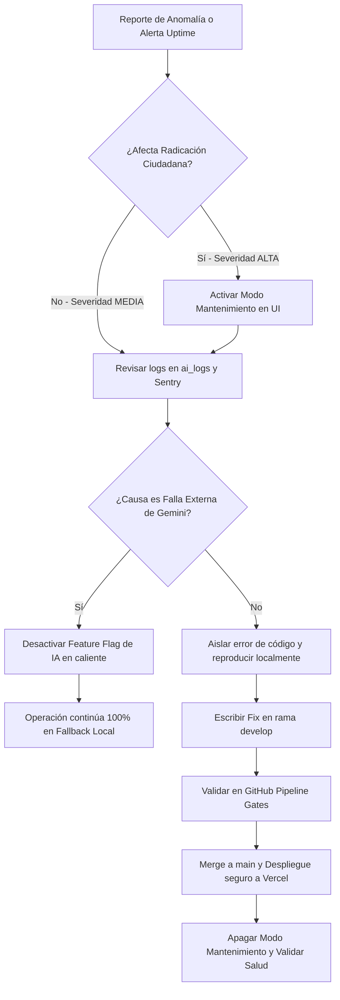

# Manual de Production Readiness y Observabilidad Viva
## Ventanilla Única Inteligente · Simacota
**Documento de Arquitectura Principal de Software Enterprise**
**Estado:** `Aprobado para Implementación` | **Clasificación:** `Uso Institucional Interno`

Este documento formaliza los planos de ingeniería, políticas de resiliencia, seguridad de datos y gobierno administrativo requeridos para garantizar el funcionamiento continuo, seguro y eficiente de la plataforma de la alcaldía de Simacota bajo condiciones de nivel de producción real.

---

## 1. Arquitectura de Observabilidad Viva

Para garantizar que la operación de la ventanilla única sea auditable y sus problemas sean anticipados antes de afectar al ciudadano, diseñamos un ecosistema de monitoreo de 360 grados:

### 1.1. Diagrama de Arquitectura de Salud y Observabilidad (Health Architecture Diagram)

El flujo de monitoreo e instrumentación viva abarca el rendimiento de los clientes, la telemetría técnica del servidor y los chequeos automatizados de terceros:

```mermaid
graph TD
    subgraph ClientLayer [Capa del Cliente (Navegador)]
        A[Navegador Ciudadano] -->|Speed Insights / Web Vitals| B[Vercel Web Analytics]
        A -->|Excepciones / Crash de JS| C[Sentry Browser SDK]
    end

    subgraph RouterLayer [Capa de Servidor Next.js (Edge / Node)]
        D[Route Handler: /api/health] -->|Prueba getDoc counter| E[(Firestore Database)]
        F[Route Handlers de IA /api/ai/*] -->|Logs de Inferencia / Latencias| G[(Firestore: ai_logs)]
        F -->|Captura de Errores de API| H[Sentry Server SDK]
    end

    subgraph MonitoringLayer [Malla de Monitoreo Externo]
        I[BetterStack / UptimeRobot] -->|Ping HTTP cada 60s| D
        I -->|Falla 2 pings consecutivos| J[Alerta TI: Discord / Email]
        K[GCP Cloud Scheduler] -->|Disparador Diario 01:00 AM| L[GCP Cloud Function]
        L -->|Respaldo Export| E
        L -->|Guardado Snapshot| M[(Google Cloud Storage Bucket)]
    end
```

### 1.2. Monitoreo de Errores con Sentry
* **Cliente y Servidor:** Instrumentación del SDK de Sentry en Next.js. Captura silenciosa de excepciones JavaScript en navegadores de ciudadanos y excepciones de ejecución en Route Handlers o Server Components.
* **Grupos de Alerta:**
  * `FATAL`: Errores que impiden la radicación (ej. fallo de persistencia en Firestore). Dispara alertas instantáneas vía Webhook a canales de TI de la alcaldía.
  * `ERROR`: Excepciones de red o de comunicación de servicios externos (ej. timeout de Gemini API).
  * `WARNING`: Avisos de desvíos cognitivos o degradación ligera de tiempos de carga.

### 1.3. Telemetría y Performance con Vercel Analytics
* **Core Web Vitals rurales:** Monitoreo del *Largest Contentful Paint (LCP)* y del *Interaction to Next Paint (INP)*. El 100% de la interfaz de radicación está optimizada para cargar de forma fluida bajo redes móviles inestables de corregimientos de Simacota.
* **Trazabilidad de Request (Correlation ID):** Cada trámite que inicia radicación recibe un ID de correlación único que viaja en las cabeceras HTTP (`X-Correlation-ID`). Si ocurre un fallo en el backend de clasificación, este ID asocia de forma unívoca el comportamiento en el cliente con las líneas de log del servidor.

### 1.4. Health Checks y Monitoreo de Uptime
* **Endpoint de Salud (`/api/health`):** Retorna un reporte en formato JSON con el estado operacional del sistema:
  * Ejecuta una consulta asíncrona de lectura no destructiva `getDoc` sobre el consecutivo de radicación actual en Firestore (`counters/radicados-{year}`) para verificar que las credenciales de base de datos son válidas y las llamadas no están bloqueadas.
  * Revisa si `GEMINI_API_KEY` está cargada en las variables de entorno e informa si la plataforma usará inferencia activa en la nube o si está operando bajo el motor determinístico de contingencia local.
* **Uptime Monitoring:** Integración con BetterStack/UptimeRobot para realizar consultas recurrentes cada `60 segundos` a `/api/health`. Ante una caída del servicio de 2 pings consecutivos, se notifica de inmediato al equipo técnico.

---

## 2. Checklist de Verificación de Observabilidad (Observability Checklist)

Antes de pasar a producción, el Jefe de TI y el Ingeniero de DevOps deben certificar y marcar la siguiente lista de verificación:

- [ ] **Configuración Sentry:**
  - [ ] Variable de entorno `SENTRY_DSN` configurada y cargada en Vercel.
  - [ ] Source Maps generados exitosamente en el bundle de build para debugear código ofuscado.
  - [ ] Enlace con el canal de notificaciones de TI de la Alcaldía activo.
- [ ] **Configuración Vercel Analytics:**
  - [ ] Web Analytics habilitado en el panel de control de Vercel.
  - [ ] Speed Insights recolectando datos de latencia en tiempo real de usuarios reales.
- [ ] **Health Endpoint (/api/health):**
  - [ ] Accesible públicamente sin requerir autenticación.
  - [ ] Retorna HTTP 200 en funcionamiento normal y HTTP 503 cuando Firestore falla.
  - [ ] Latencia de respuesta del endpoint inferior a `250ms` en condiciones normales.
- [ ] **Logging de IA (ai_logs):**
  - [ ] Registros creándose correctamente en la colección de Firestore en cada inferencia de `/api/ai/classify` y `/api/ai/copilot`.
  - [ ] Monitores visuales de latencia y Feature Flags renderizando datos correctos en el Dashboard Administrativo.

---

## 3. Estrategia de Resiliencia y Tolerancia a Fallas

Diseñamos una arquitectura tolerante a fallos para proteger la ventanilla única contra interrupciones de red o cuotas de consumo agotadas en las APIs de IA:

### 3.1. Diseño del Circuit Breaker Cognitivo
Cuando el Route Handler interactúa con la API de Gemini, se ejecuta bajo el control de un interruptor lógico de tres estados:

* **Cerrado (Closed):** Las consultas se envían a Gemini de forma ordinaria.
* **Abierto (Open):** Si se registran `5 fallas consecutivas` (timeouts, cuota agotada o HTTP 500/503), el circuito se abre. Durante este periodo, la plataforma no consume la API externa; desvía el 100% de las consultas de forma inmediata a los **algoritmos determinísticos locales**.
* **Medio Abierto (Half-Open):** Pasados 60 segundos, se envía una pequeña muestra de consultas (petición de prueba). Si son exitosas, el circuito se cierra de nuevo; si fallan, se vuelve a abrir.

### 3.2. Política de Reintentos (Retry Policy) y Rate Limiting
* **Backoff Exponencial con Jitter:** Para llamadas asíncronas secundarias (como la redacción de borradores del copiloto), el cliente reintenta la consulta en caso de error de red con retrasos progresivos: $T_{delay} = 2^{intento} \times 1000\text{ms} + \text{jitter}$.
* **Protección ante Rate Limits:** Control de cuota en el Route Handler que limita a un máximo de `10 peticiones por minuto` por dirección IP para evitar abuso del Portal Ciudadano o inyección masiva de solicitudes maliciosas que incrementen los costos del municipio.

### 3.3. Degradación Progresiva del Sistema
Si los servicios de IA de Google se encuentran completamente caídos en todo el país:
1. El Portal Ciudadano deshabilita el chat interactivo de SIMI de forma no bloqueante, mostrando un mensaje informando del mantenimiento técnico preventivo.
2. El formulario de radicación continúa funcionando de forma normal.
3. El clasificador local infiere la secretaría destino mediante búsquedas regex locales.
4. El panel administrativo oculta temporalmente la pestaña "Copiloto IA ✦", permitiendo al funcionario resolver el trámite mediante redacción manual tradicional. El servicio jamás se detiene.

---

## 4. Estrategia DevSecOps y Ciclo de Vida del Software

Para mantener la higiene técnica y la estabilidad del código en producción, formalizamos las políticas de ramas y despliegue continuo (CI/CD):

### 4.1. Protección de Ramas y Flujo GitFlow
* **`main` (Producción):** Rama protegida. Solo se modificará mediante Pull Requests aprobados provenientes de ramas de estabilización `release/*`. Requiere compilación y tests exitosos antes de fusionar.
* **`develop` (Integración):** Integración de características completas antes del empaquetado formal.
* **`feature/*` (Desarrollo):** Aislado para modificaciones puntuales.

### 4.2. Borrador del Pipeline de GitHub Actions (GitHub Actions Pipeline Draft)

El siguiente flujo automatizado de CI (`.github/workflows/ci.yml`) debe activarse obligatoriamente en cada Pull Request hacia `main` o `develop`:

```yaml
name: CI/CD Pipeline - Ventanilla Única Simacota

on:
  push:
    branches: [ main, develop ]
  pull_request:
    branches: [ main, develop ]

jobs:
  validate:
    name: Build & Security Gates
    runs-on: ubuntu-latest

    steps:
      - name: Checkout Code
        uses: actions/checkout@v4

      - name: Setup Node.js
        uses: actions/setup-node@v4
        with:
          node-version: 20
          cache: 'npm'

      - name: Install Dependencies
        run: npm ci

      - name: Lint Check (Linter Gate)
        run: npm run lint

      - name: TypeScript Compile Check (Type Gate)
        run: npx tsc --noEmit

      - name: Security Scan (NPM Audit Gate)
        run: npm audit --audit-level=high

      - name: Production Build Check (Build Gate)
        run: npm run build
        env:
          NEXT_PUBLIC_FIREBASE_API_KEY: ${{ secrets.NEXT_PUBLIC_FIREBASE_API_KEY }}
          NEXT_PUBLIC_FIREBASE_AUTH_DOMAIN: ${{ secrets.NEXT_PUBLIC_FIREBASE_AUTH_DOMAIN }}
          NEXT_PUBLIC_FIREBASE_PROJECT_ID: ${{ secrets.NEXT_PUBLIC_FIREBASE_PROJECT_ID }}
          NEXT_PUBLIC_FIREBASE_STORAGE_BUCKET: ${{ secrets.NEXT_PUBLIC_FIREBASE_STORAGE_BUCKET }}
          NEXT_PUBLIC_FIREBASE_MESSAGING_SENDER_ID: ${{ secrets.NEXT_PUBLIC_FIREBASE_MESSAGING_SENDER_ID }}
          NEXT_PUBLIC_FIREBASE_APP_ID: ${{ secrets.NEXT_PUBLIC_FIREBASE_APP_ID }}
```

---

## 5. Estrategia de Backups, Automatización y Disaster Recovery (DR)

La resiliencia de la base de datos municipal se rige bajo una política estricta de protección de datos:

### 5.1. Plan de Automatización de Copias de Seguridad (Backup Automation Plan)

Para cumplir con las normas de auditoría de archivo público en Colombia, programamos las copias automáticas en la consola de Google Cloud de la siguiente manera:

* **Configuración del GCP Cloud Scheduler:**
  * **Nombre de Tarea:** `backup-firestore-simacota`
  * **Frecuencia (Cron):** `0 1 * * *` (Todos los días a la 01:00 AM COT)
  * **Destino:** HTTP Target (Cloud Function con permisos de IAM de propietario sobre Firestore).
* **Comando nativo de GCP para la Cloud Function:**
  ```javascript
  const firestore = require('@google-cloud/firestore');
  const client = new firestore.v1.FirestoreAdminClient();

  const databaseName = client.databasePath(process.env.GCP_PROJECT_ID, '(default)');
  const bucketUrl = 'gs://respaldos-simacota/diario';

  await client.exportDocuments({
    name: databaseName,
    outputUriPrefix: bucketUrl,
    collectionIds: [] // Un array vacío exporta TODAS las colecciones automáticamente
  });
  ```
* **Redundancia Geográfica:** Los buckets están configurados en modo Multi-Región (ej. `us-east1` y `us-east4`), protegiendo los datos contra fallos físicos catastróficos en un centro de cómputo completo de Google.
* **Retención de Datos:** Snapshots Diarios: Conservados por `30 días`. Exportaciones Mensuales: Respaldos consolidados en almacenamiento frío (*Coldline*) con retención obligatoria de `10 años`.

### 5.2. Procedimientos de Rollback y Restauración (Rollback & Restoration Procedures)

En caso de corrupción masiva de datos o pérdida accidental por acciones de terceros:

#### Pasos para la Restauración Total o Parcial de Firestore:

1. **Declaración de Mantenimiento (Modo Lectura Única):**
   * Modificar el Feature Flag global `MAINTENANCE_MODE = true` en Firestore (o mediante variable de entorno) para congelar escrituras en el Portal Ciudadano.
2. **Identificación de la Copia de Seguridad:**
   * Entrar a la consola de GCP Storage o correr el comando para listar respaldos:
     ```bash
     gcloud storage ls gs://respaldos-simacota/diario/
     ```
   * Seleccionar la carpeta correspondiente a la última fecha y hora consistente (ej. `gs://respaldos-simacota/diario/2026-05-28T01:00:03_4719/`).
3. **Ejecución del Comando de Restauración (Import):**
   * Correr el comando de importación en la consola de comandos de GCP:
     ```bash
     gcloud firestore import gs://respaldos-simacota/diario/2026-05-28T01:00:03_4719/
     ```
   * *Para restauración parcial de una colección específica (ej. solo usuarios):*
     ```bash
     gcloud firestore import gs://respaldos-simacota/diario/.../ --collection-ids=usuarios
     ```
4. **Validación de Consistencia:**
   * Ejecutar pruebas en caliente comprobando que el documento `counters/radicados-{year}` coincida con el ID del último radicado real expedido antes de la copia.
5. **Reapertura de la plataforma:**
   * Cambiar `MAINTENANCE_MODE = false` para reestablecer la radicación pública.

---

## 6. Pruebas Operativas Reales (Stress Testing)

Antes de abrir el servicio a los ciudadanos de Simacota, el sistema debe ser validado bajo simulaciones rigurosas que imiten las condiciones de operación real:

### 6.1. Pruebas de Latencia y Conexión Rural
Para simular el acceso de ciudadanos ubicados en veredas apartadas con mala conectividad móvil:
* Se configuran perfiles de red artificiales mediante Chrome DevTools que emulan conexiones móviles **3G Lento / 2G** (latencias de `800ms` a `1500ms`, pérdida de paquetes del `5%`).
* **Criterio de Aceptación:** El Portal Ciudadano debe cargar los inputs esenciales en menos de `4 segundos` y no congelar la pantalla ni abortar la sesión ante micro-cortes durante la radicación.

### 6.2. Simulación de Carga Concurrente (Multiusuario)
* **Stress Test de Radicación:** Scripts de carga asíncronos que disparan `50 solicitudes de radicación concurrentes` en una ventana de 5 segundos hacia el endpoint `/api/ai/classify`.
* **Criterio de Aceptación:** El servidor de Next.js y los pools de conexión de Firebase deben absorber el tráfico con una tasa de éxito del 100% y tiempos de respuesta de clasificación promedio inferiores a `3.5 segundos`.

---

## 7. Gobierno Operacional y Flujo de Respuesta a Incidentes (Incident Response Flow)

Establecemos el marco normativo y organizativo para administrar y supervisar el uso de la Ventanilla Única Inteligente:

### 7.1. Acuerdos de Niveles de Servicio (SLA)
* **SLA de Disponibilidad de la Plataforma:** **99.9%** de tiempo en línea durante el año (máximo 8.7 horas de inactividad anual acumulada).
* **SLA de Asistencia de IA:** **99.5%** de disponibilidad operacional. Si la IA falla, los mecanismos locales determinísticos de fallback deben absorber el 100% del procesamiento.

### 7.2. Flujo de Respuesta a Incidentes (Incident Response Flow)

El siguiente flujograma de acciones coordinadas rige ante reportes de anomalías o caídas técnicas del servicio:



### 7.3. Métricas de Adopción e Impacto (ROI de la IA)
Para medir si la inversión en IA del municipio se traduce en eficiencias reales para el ciudadano, el Administrador evaluará mensualmente:
* **Tasa de Aceptación de Borradores:** Porcentaje de respuestas oficiales de secretaría que adoptan el texto sugerido por los copilotos.
* **Tiempo Promedio de Resolución (MTTR):** Reducción de los tiempos promedio de respuesta de PQRS en secretarías que usan copilotos activos frente al histórico manual de años anteriores.
* **Tasa de Discrepancia:** Volumen de *overrides* de enrutamiento semántico registrados en `ai_auditoria`, sirviendo de insumo directo para afinar los prompts en futuras versiones.

---

## 8. Plan de Verificación de Producción (Verification Plan)

Para certificar que la Fase 5.1.A está operando perfectamente, el equipo técnico ejecutará las siguientes verificaciones físicas tras el despliegue:

### 8.1. Pruebas Automatizadas
* **Health Check API validation:**
  ```bash
  curl -i https://ventanilla.simacota.gov.co/api/health
  ```
  * *Verificar:* Retorno de cabecera `HTTP/1.1 200 OK`, JSON legible conteniendo `"status": "healthy"`, `"firestore": { "status": "connected" }` y la latencia en milisegundos.
* **Simulación de Caída de Base de Datos (Error Handling Check):**
  * Cambiar temporalmente la variable `NEXT_PUBLIC_FIREBASE_PROJECT_ID` a un valor inválido en un entorno de desarrollo.
  * Ejecutar ping a `/api/health` y validar que el endpoint responda con `HTTP 503 Service Unavailable` y capture correctamente la traza de error sin crashear el proceso global de Node.

### 8.2. Pruebas Manuales
* **Verificación de logs de telemetría:**
  * Acceder a la consola de administración, radicar una solicitud de prueba en el portal ciudadano.
  * Entrar al Panel de Supervisión Administrativa y comprobar que el log correspondiente se haya creado en la tabla con la latencia exacta del servidor y el estado `SUCCESS`.
